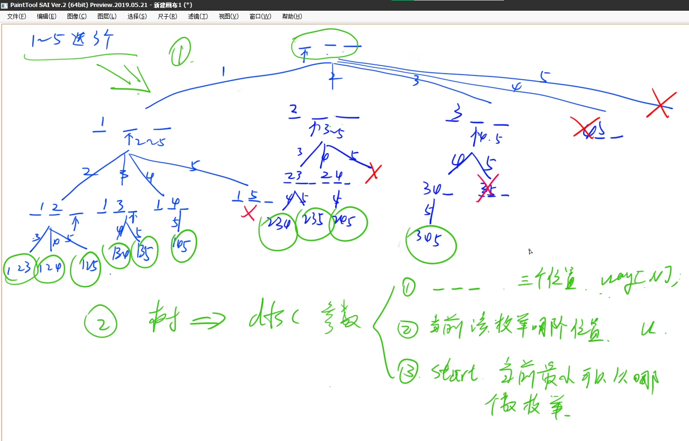
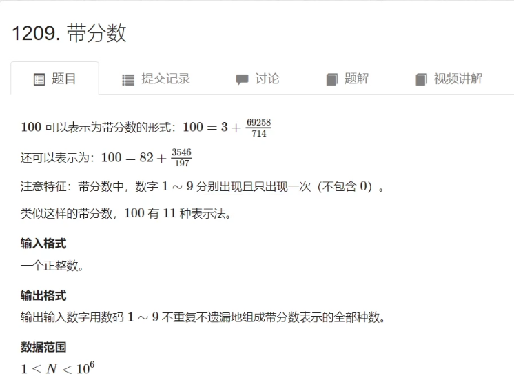

题目


# [AcWing 92. 递归实现指数型枚举](https://www.acwing.com/problem/content/94/)

从 1∼n 这 n个整数中随机选取任意多个，输出所有可能的选择方案。

**输入格式**

输入一个整数 n 。

**输出格式**

每行输出一种方案。

同一行内的数必须升序排列，相邻两个数用恰好 11 个空格隔开。

对于没有选任何数的方案，输出空行。

本题有自定义校验器（SPJ），各行（不同方案）之间的顺序任意。

**数据范围**

1≤n≤15

**输入样例：**

```
3
```

**输出样例：**

```
3
2
2 3
1
1 3
1 2
1 2 3
```


**代码**

```py
# 1≤n≤15
N = 15
# 输入的n
n = 0
# 状态
# 0 还没考虑 1 选择 2 不选择
states = [0 for i in range(N)]


def dfs(u):
    if u >= n:
        # 遍历打印
        for index, st in enumerate(states):
            if st == 1:
                print(index + 1, end="")
        print()
        return
    states[u] = 2
    dfs(u + 1)
    states[u] = 1
    dfs(u + 1)


if __name__ == '__main__':
    n = int(input())
    dfs(0)
```


# [AcWing 93. 递归实现组合型枚举](https://www.acwing.com/problem/content/95/)


递归实现组合型枚举




# [AcWing 94. 递归实现排列型枚举](https://www.acwing.com/problem/content/96/)


# [AcWing 717. 简单斐波那契](https://www.acwing.com/problem/content/719/)


# [AcWing 95. 费解的开关(需要付费)]()


# [AcWing 1209. 带分数](https://www.luogu.com.cn/problem/P8599)

 


# [AcWing 116.飞行员兄弟](https://www.acwing.com/problem/content/118/)


# [AcWing 1208. 翻硬币](https://www.luogu.com.cn/problem/P8597)


递归记得画树状图

字典序的定义