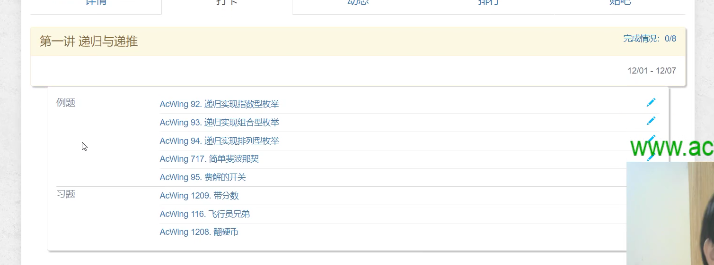

题目

[AcWing 92. 递归实现指数型枚举](https://www.acwing.com/problem/content/94/)

[AcWing 93. 递归实现组合型枚举](https://www.acwing.com/problem/content/95/)

[AcWing 94. 递归实现排列型枚举](https://www.acwing.com/problem/content/96/)

[AcWing 717. 简单斐波那契](https://www.acwing.com/problem/content/719/)

[AcWing 95. 费解的开关(需要付费)]()

[AcWing 1209. 带分数](https://www.luogu.com.cn/problem/P8599)

[AcWing 116.飞行员兄弟](https://www.acwing.com/problem/content/118/)

[AcWing 1208. 翻硬币](https://www.luogu.com.cn/problem/P8597)

递归记得画树状图

字典序的定义