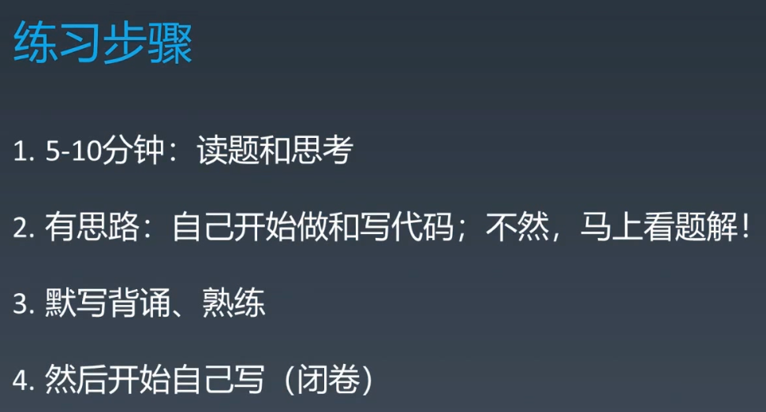

# 脑图

- [数据结构脑图](http://naotu.baidu.com/file/b832f043e2ead159d584cca4efb19703?token=7a6a56eb2630548c)
- [算法脑图](http://naotu.baidu.com/file/0a53d3a5343bd86375f348b2831d3610?token=5ab1de1c90d5f3ec)

----

# 主定理

 

**常用算法中的应用**

|                  算法                  |                          递回关系式                          |      运算时间      |     备注      |
| :------------------------------------: | :----------------------------------------------------------: | :----------------: | :-----------: |
|              二分搜索算法              |       $T(n)=T\left({\frac  {n}{2}}\right)+\Theta (1)$        | $\Theta (\log n)$  | $\epsilon =0$ |
|               二叉树遍历               |       $T(n)=2T\left({\frac  {n}{2}}\right)+\Theta (1)$       |    $\Theta (n)$    |    情形一     |
| 最佳排序矩阵搜索（已排好序的二维矩阵） | $\displaystyle T(n)=2T\left({\frac {n}{2}}\right)+O(\log n)$ |    $\Theta(n)$     |               |
|                归并排序                |       $T(n)=2T\left({\frac  {n}{2}}\right)+\Theta (n)$       | $\Theta (n\log n)$ | $\epsilon =0$ |

------------

# 复杂度分析

------------

# 练习步骤

 

