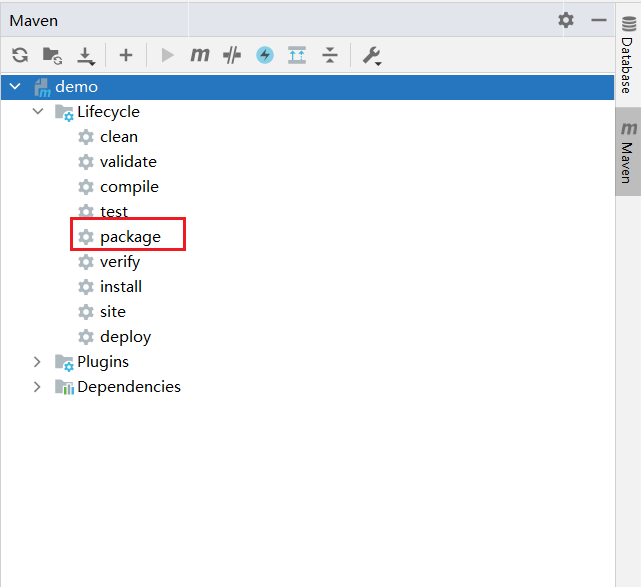
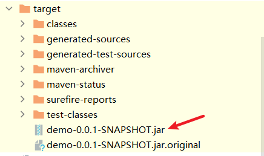

## 一、云端环境准备

以下部署基于Centos7 系统环境

### 1.1 安装MySQL 

卸载Centos7自带mariadb

~~~shell
# 查找
rpm -qa|grep mariadb
# mariadb-libs-5.5.52-1.el7.x86_64
# 卸载
rpm -e mariadb-libs-5.5.52-1.el7.x86_64 --nodeps
~~~

解压mysql

~~~shell
# 创建mysql安装包存放点
mkdir /usr/server/mysql
# 解压
tar xvf mysql-5.7.34-1.el7.x86_64.rpm-bundle.tar
~~~

执行安装

~~~shell
# 切换到安装目录
cd /usr/server/mysql/
yum -y install libaio
yum -y install libncurses*
yum -y install perl perl-devel
# 安装
rpm -ivh mysql-community-common-5.7.34-1.el7.x86_64.rpm 
rpm -ivh mysql-community-libs-5.7.34-1.el7.x86_64.rpm 
rpm -ivh mysql-community-client-5.7.34-1.el7.x86_64.rpm 
rpm -ivh mysql-community-server-5.7.34-1.el7.x86_64.rpm
~~~

启动Mysql

~~~shell
#启动mysql
systemctl start mysqld.service
#查看生成的临时root密码
cat  /var/log/mysqld.log | grep password
~~~


修改初始的随机密码

~~~shell
# 登录mysql
mysql -u root -p
Enter password:     #输入在日志中生成的临时密码
# 更新root密码  设置为root
set global validate_password_policy=0;
set global validate_password_length=1;
set password=password('root');
~~~

授予远程连接权限

~~~shell
grant all privileges on *.* to 'root' @'%' identified by 'root';
# 刷新
flush privileges;
~~~

控制命令

~~~shell
#mysql的启动和关闭 状态查看
systemctl stop mysqld
systemctl status mysqld
systemctl start mysqld

#建议设置为开机自启动服务
systemctl enable  mysqld
#查看是否已经设置自启动成功
systemctl list-unit-files | grep mysqld
~~~

关闭防火墙

```shell
firewall-cmd --state #查看防火墙状态
systemctl stop firewalld.service  #停止firewall
systemctl disable firewalld.service  #禁止firewall开机启动
```

### 1.2 安装nginx

```shell
yum install epel-release
yum update
yum -y install nginx
```

nginx命令

```shell
systemctl start nginx #开启nginx服务
systemctl stop nginx #停止nginx服务
systemctl restart nginx #重启nginx服务
```

### 1.3 配置JDK

下载JDK，登录官方https://www.oracle.com/java/technologies/downloads/#java8 下载所需版本的 JDK，版本为JDK 1.8


解压

~~~shell
tar -zvxf jdk-8u131-linux-x64.tar.gz
~~~

编辑 /etc/profile 文件

~~~
vi /etc/profile
# 文件末尾增加
export JAVA_HOME=/usr/server/jdk1.8.0_131
export PATH=${JAVA_HOME}/bin:$PATH
~~~

执行source命令，使配置立即生效

~~~
source /etc/profile
~~~

检查是否安装成功

~~~
java -version
~~~

## 二、项目部署

### 2.1 部署Vue项目

#### 打包Vue项目

进入到Vue项目目录，执行

~~~shell
npm run build
~~~

将生成的dist目录上传至服务器 /usr/vue/dist

#### 配置nginx

进入到/etc/nginx/conf.d目录，创建vue.conf文件，内容如下

~~~properties
server {
    listen       80;
    server_name  locahost;

    location / {
        root /usr/app/dist;
        index index.html;
    }
}
~~~

使配置生效

~~~
nginx -s reload
~~~

### 2.2 打包Java程序

双击package，会自动打包在项目路径文件夹的/target文件夹下





因为springboot有内置tomcat容器，这点比较方便，省去了tomcat的部署。我们到时候直接可以直接把jar包扔到linux上。

```shell
nohup java -jar shop-0.0.1-SNAPSHOT.jar > logName.log 2>&1 &
```