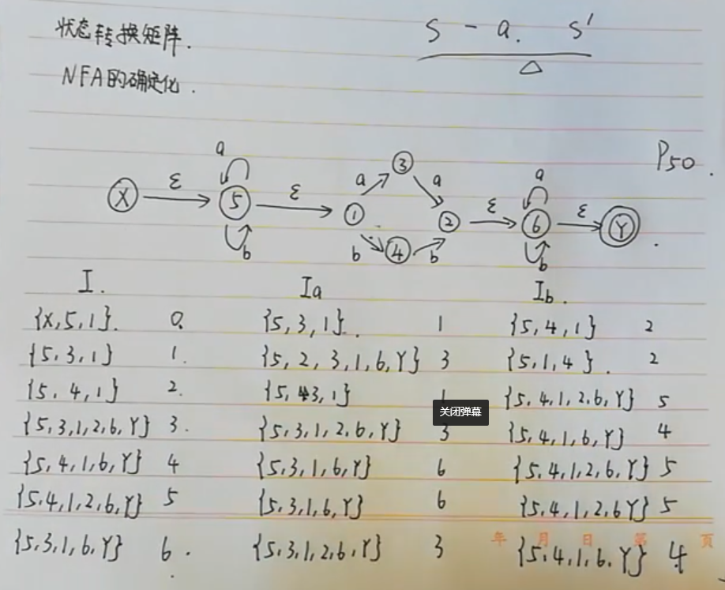

## 上下文无关文法(填空题)

一个上下文无关文法G包括四个组成部分

1. 一组终结符号
   1. 小写字母
   2. 加号乘号
2. 一组非终结符号
   1. 大写字母
3. 一个开始符号
4. 一组产生式
   1. 箭头->

- 例子
  - `E -> i | EAE`
  - `A -> + | *`

## 语法分析树

- 二义性：一个文法对于同一个句子有多个语法分析树

## 状态转换图

就是一个有限方向图

无缘屎

- DFA

 

- NFA

​	

- NFA的确定化

 

## 