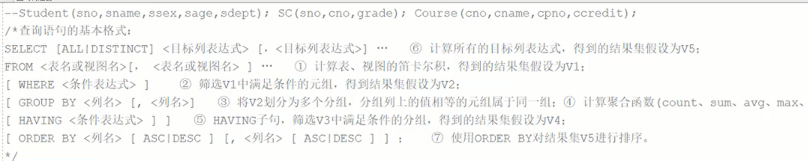

# 命令

- 创建表

```sql
create table student
(
    sno char(9) Primary key,/*实体完整性规则:主码sno的取值唯一并且主属性取值不能是空值NULL*/
    sname char(20) unique,/*unique 是唯一约束,表示sname的取值必须唯一*/
    ssex char(3),
    sdept char(20)
);

create table course
(
	cno char(4) primary key,/*主码约束,cno取值唯一并且不能为空*/
    cname char(40),
    cpno char(4),
    ccredit smallint,
    foreign key(cpno) references course(cno) /*参照完整性规则:Cpno取值可以是空值NULL或者等于被参照表course的cno的某个值*/ 
);

create table sc
(
	sno char(9),
    cno char(4),
    grade smallint,
    primary key(sno,cno),/*属性组(sno,cno)的取值唯一,主属性sno,cno取值不能为空*/
    foreign key(sno) references student(sno),
    foreign key(cno) references course(cno)
);

```

- 查询表的结构

```sql
desc student
```

- 查询表的数据



```sql
--查询所有
select * from student,sc;/*两个表就查询笛卡尔积(所有可能的组合)*/

--查询两个表的sno相同的列
select * from student,sc where student.sno=sc.sno;

--对结果集分组
select * from student,sc where student.sno=sc.sno group by student.sno;

--计算总分
select student.sno,sum(grade),avg(grade) from student,sc where student.sno=sc.sno group by student.sno;

--使用groupby分组时,只有分组列可以直接卸载select后面,其他非分组列只能放在聚合函数中
select student.sno,sname,sum(grade) 总分,avg(grade) 平均分 from student,sc where student.sno=sc.sno group by student.sno,sname;

--对分组后的借过集进行筛选
having avg(grade)>88;
--排序
having avg(grade)>80 order by 平均分 asc;

--去除重复的记录
select distinct sno from sc;

--条件查询
select distinct sno from sc where grade>=88;
select sname,sdept,sage from student where sage>=20 and sage<=23;
select sname,sdept,sage from student where sage between 20 and 23;

--效果等价
select sname,sdept,sage from student where not (sage>=20 and sage<=23);
select sname,sdept,sage from student where sage<0 orsage>23;
select sname,sdept,sage from student where sage not between 20 and 23;

--where 列 in ('IS','CS')集合
select sname,sdept,sage from student where sdept in ('IS','CS');

--先按系升序,再按年龄降序
select * from student order by sdept,sage desc;

--mo'h

```

- 插入数据

```sql
insert into Student (sname,ssex,sno,sage,sdept) values('李勇','男','201215121',20,'CS');
insert into Student (sname,ssex,sno,sage,sdept) values('李勇','男','201215121',20,'CS');
insert into Student (sname,ssex,sno,sage,sdept) values('李勇','男','201215121',20,'CS');
insert into Student (sname,ssex,sno,sage,sdept) values('李勇','男','201215121',20,'CS');
```

- 提交数据

```sql
commit;
```

- 表增加列

```sql
alter table student add pwd varchar(20);
```

- 修改表的列的类型

```sql
alter table student modify pwd char(20);
```

- 删除表的列

```sql
alter table student drop column pwd;
```

- 给表添加约束条件,限制课程名称取唯一值,约束名称为unique_cname

```sql
alter table course add constraint unique(cname);
```

- 给表删除约束条件,unique_cname

```sql
alter table course drop constraint unique_cname;
```

- 删除基本表

```sql
drop table student cascade constraints;
```

- 创建索引

```sql
--为Student表创建所在系降序索引,名为idx_sdept
create index idx_sdept on student(sdept desc);

--为SC表按学号升序和课程号降序建立唯一索引,索引名为idx_snocno;
create unique index idx_snocno on sc(sno asc,cno desc);

--
```

- 更名索引

```sql
alter index idx_snocno rename to idxSCno;
```

- 删除索引

```sql
drop index idxSCno
```

- 


