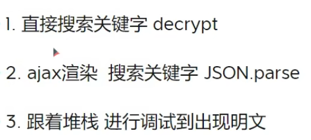

# 安装第三方库

- 安装执行js文件的execjs	`pip install pyexecjs2`

  - 使用方法

  ```py
  res = execjs.compile(open('filename','r',encoding='utf-8').read()).call('fname',param)
  ```

  - 使用前提环境配置

    导包之前先执行此操作,避免执行js时报错

  ```py
  import subprocess
  from functools import partial
  subprocess.Popen = partial(subprocess.Popen, encoding='utf-8')
  ```

  

- 安装加密算法库	`npm install crypto-js`


# 数据加密

**没有js混淆的情况**

- 常用方法查找加密代码



- 把加密算法库导入js文件

```js
const CryptoJS = require('crypto-js')
```


### 消息摘要算法

- 怎么调用

```js
const crypto = require('crypto')

function Sha256encrypt(text){
    // 消息摘要算法
    return crypto.createHash('sha256').update(text).digest('hex');
}
```


### MD5加密算法

- 怎么调用

```js
const crypto = require('crypto')

function MD5Encrypt(text) {
    // md5算法
    return crypto.createHash('md5').update(text).digest('hex');
}
```


请求数据:dic

dic转为str

str转为json str


json str压缩(进制流压缩)会变成一个数组

压缩的数据转为密文数(进制流压缩)


密文解压为数组 	

数组解压为jsonstr


base64用来做编码处理 `base64.b64encode()`

zlib是用来压缩包 `zlib.compress()`	`zlib.decompress()`

