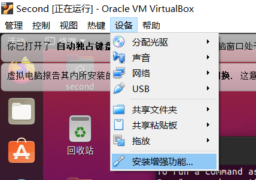
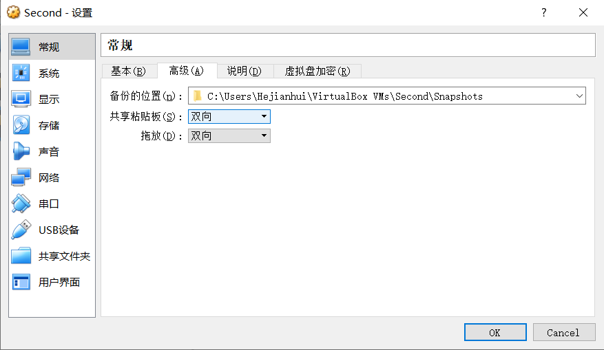

# 部署虚拟机环境

- 安装VirtualBox虚拟机	[下载网址](https://www.virtualbox.org/wiki/Download_Old_Builds_5_2)

  1. 在里面选择`Windows hosts`
  2. 打开安装文件,一路点击"下一步",留意安装位置,将C盘改为其他盘

- 在虚拟机安装Linux操作系统

  1. 选择镜像网站	[Tsinghua Open Source Mirror](https://mirrors.tuna.tsinghua.edu.cn/ubuntu-releases/20.04/)

  2. 选择`ubuntu-20.04.6-desktop-amd64.iso`

  3. 打开VirtualBox,选择"新建",

  4. 名称随意起

  5. 内存大小设置为4096MB

  6. 选择"现在创建虚拟硬盘"

  7. 选择 VDI (VirtualBox磁盘映像)

  8. 选择"动态分配"

     **动态分配是指：假设虚拟硬盘文件在实际硬盘中能用的极限大小是10G，选择动态分配的话，虚拟硬盘在实际硬盘中占用的空间是0~10G**

     **固定大小是指：假设虚拟硬盘文件在实际硬盘中能用的极限大小是10G，选择固定大小的话，虚拟硬盘占用实际硬盘的大小永远是10G，无论空间是否全部使用**

- 配置虚拟机

  1. 把处理器数量调到4,显存大小拉满
  2. 安装虚拟盘,将刚刚在镜像网站下载Ubuntu文件复制到自己的熟悉路径
  3. 
  4. 

- 安装Ubuntu
  1. 点击启动，点击设备分配光驱，安装Ubuntu，选择中文，最小安装，清除整个磁盘并安装Ubuntu,创建账户

------

# 设置数据双向传输

- 先修改快捷键,把复制粘贴改为 `ctrl+c` 和 `ctrl+v`

- 先安装增强功能

  

- 关机,去配置双向

  

- 然后开机即可

-----------

# 修改apt源

- 安装vim `sudo apt-get install vim`

- 输入`sudo vim /etc/apt/sources.list`

- 文件末尾加上，注意不需要替换原有的

```D
#阿里源
deb http://mirrors.aliyun.com/ubuntu/ focal main restricted universe multiverse
deb-src http://mirrors.aliyun.com/ubuntu/ focal main restricted universe multiverse
deb http://mirrors.aliyun.com/ubuntu/ focal-security main restricted universe multiverse
deb-src http://mirrors.aliyun.com/ubuntu/ focal-security main restricted universe multiverse
deb http://mirrors.aliyun.com/ubuntu/ focal-updates main restricted universe multiverse
deb-src http://mirrors.aliyun.com/ubuntu/ focal-updates main restricted universe multiverse
deb http://mirrors.aliyun.com/ubuntu/ focal-backports main restricted universe multiverse
deb-src http://mirrors.aliyun.com/ubuntu/ focal-backports main restricted universe multiverse
deb http://mirrors.aliyun.com/ubuntu/ focal-proposed main restricted universe multiverse
deb-src http://mirrors.aliyun.com/ubuntu/ focal-proposed main restricted universe multiverse
```

- 接着执行

```shell
sudo apt-get update
sudo apt-get upgrade
Reboot
```


