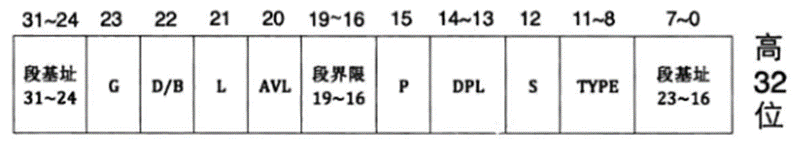
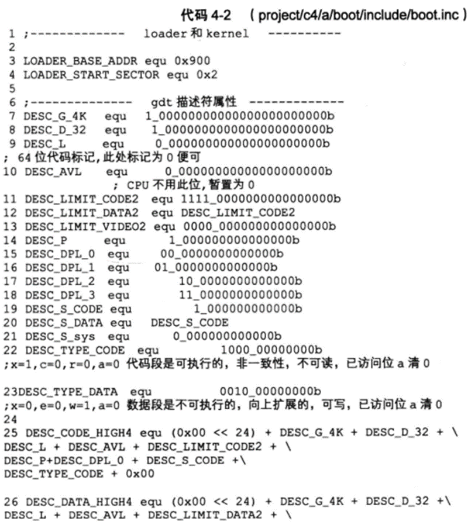
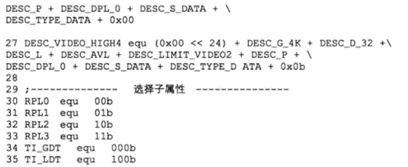
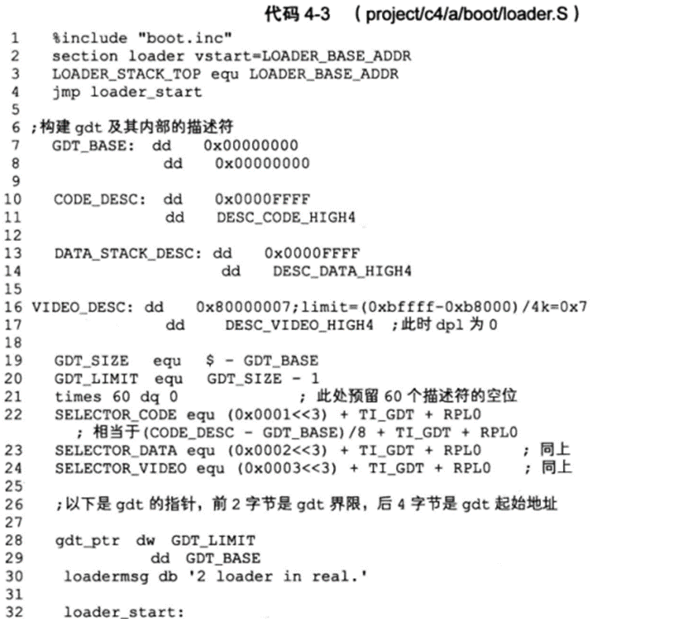
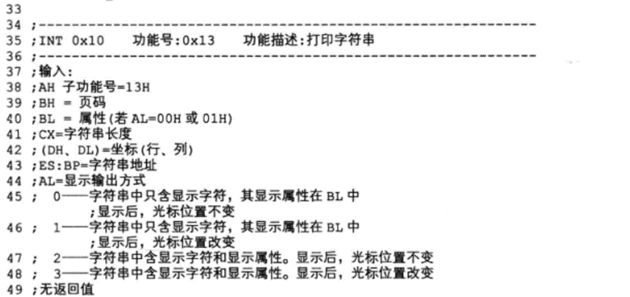
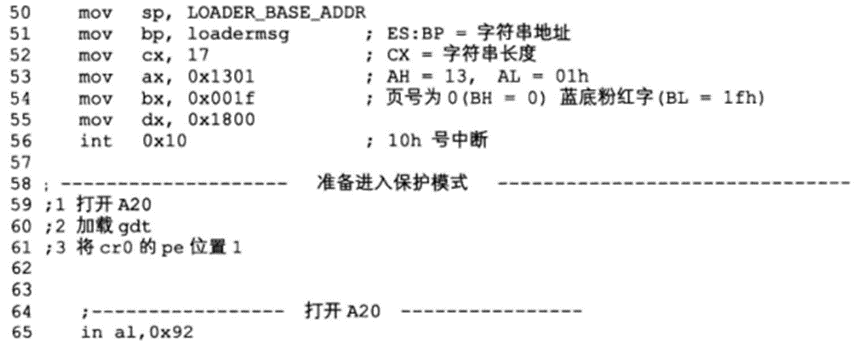
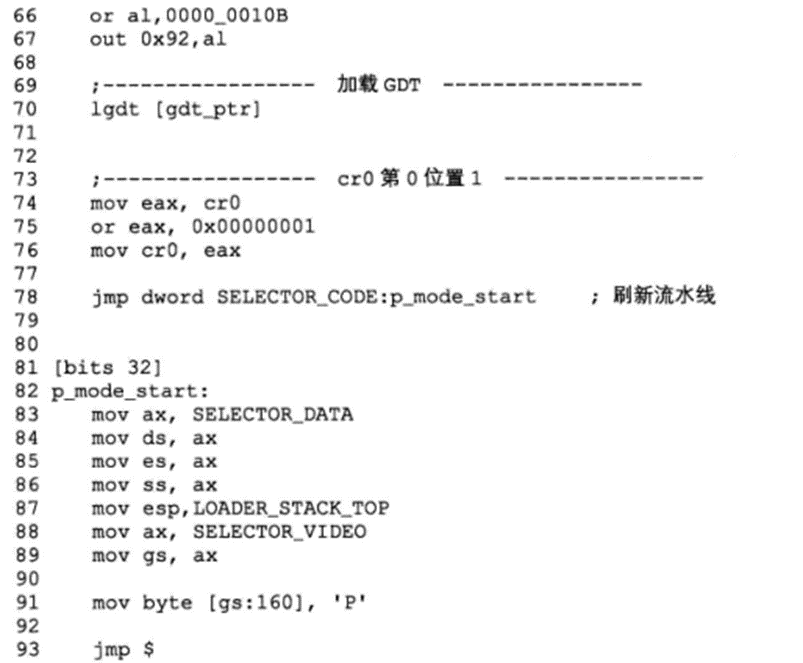

# 寄存器

- 段寄存器	CS DS SS ES
- 通用寄存器	16位:AX BX CX DX	32位:EAX
- 指令指针寄存器	IP
- 标志寄存器	
- 控制寄存器CR(control register)0-3	CR0 CR1 CR2 CR3 CR4


> 实模式下的地址线是 20 位,寻址空间多少?

20条线,即最大能表示2^20-1 = 1048575,寻址范围为0x00000~0xFFFFF(范围为1048576 = 1024*1024),

结合16位寄存器,可以实现1MB的寻址范围:

​	16 bits 的程序计数器首先从存储器中取得指令放入8 bits 的指令寄存器。

​	指令寄存器暂存放入的指令然后交给译码器取进行解析。

​	指令译码器将解析后的命令交给控制逻辑部件去执行操作。

​	我们知道存储器的内部结构是以字节形式组织的，所以cpu每次只能取得一条指令然后执行，接着重复上述操作，直至所有指令全部执行完毕。

​	这就是早期的串行结构设计。

---

> #### 一些指令

- 启动bochs `bin/bochs -f bochsrc.disk`


- 编译mbr `nasm -o mbr.bin mbr.s`
- 编译mbr,并指定库目录 `nasm -I include/ -o mbr.bin mbr.s`
- 写mbr入硬盘 `dd if=./mbr.bin of=./hd60M.img bs=512 count=1 conv=notrunc`


- 指定库编译loader `nasm -I include/ -o loader.bin loader.s`
- 写loader入硬盘 `dd if=./loader.bin of=./hd60M.img bs=512 count=1 seek=2 conv=notrunc`

----

# 实验三分析

## 一 

> 用BIOS中断打印字符串

- 存放BIOS程序的ROM空间被映射到实模式下1MB内存的顶部，即地址0xF0000-0xFFFFF处，共64KB,其中顶部的**0xFFFF0~0xFFFFF**这16B空间是BIOS程序的入口地址

- 开机后CS:IP值，其值是F000:FFF0,指令地址就是**0xFFFF0**。BIOS程序开始运行
  1. 检测和初始化硬件；
  2. 建立中断向量表（即硬件I/O的操作）
  3. 校验启动盘中位于0盘0道1扇区的内容（检测到末尾的两个字节分别是`0x55`和`0xaa`时，就认为该扇区存放MBR）
- 此代码通过改变寄存器的值,对应的调用多次INT 10H中断函数,来达到打印相应字符串的结果

```assembly
;主引导程序 
;------------------------------------------------------------
SECTION MBR vstart=0x7c00	;0x7c00是mbr的入口地址         
   mov ax,cs	;ax=0xF000
   mov ds,ax	;ds=0xF000
   mov es,ax	;es=0xF000
   mov ss,ax	;ss=0xF000
   mov fs,ax	;fs=0xF000
   mov sp,0x7c00	;sp=0x7c00

; 清屏 利用0x06号功能，上卷全部行，则可清屏。
; -----------------------------------------------------------
;INT 0x10   功能号:0x06	   功能描述:上卷窗口
;------------------------------------------------------
;输入：
;AH 功能号= 0x06
;AL = 上卷的行数(如果为0,表示全部)
;BH = 上卷行属性
;(CL,CH) = 窗口左上角的(X,Y)位置
;(DL,DH) = 窗口右下角的(X,Y)位置
;无返回值：
   mov     ax, 0x600	;ax=0x0600	清屏范围,也就是宽度
   mov     bx, 0x700	;bx=0x0700
   mov     cx, 0        ;cx=0x0000	左上角: (0, 0)
   mov     dx, 0x184f	;dx=0x184f	右下角: (80,25),
			   ; VGA文本模式中,一行只能容纳80个字符,共25行。
			   ; 下标从0开始,所以0x18=24,0x4f=79
   int     0x10            ; int 0x10

;;;;;;;;;    下面这三行代码是获取光标位置    ;;;;;;;;;
;.get_cursor获取当前光标位置,在光标位置处打印字符.
   mov ah, 3	;ah=0x03 ax=0x0300	输入: 3号子功能是获取光标位置,需要存入ah寄存器
   mov bh, 0	;bh=0x00 bx=0x0000	bh寄存器存储的是待获取光标的页号

   int 0x10		; 输出: ch=光标开始行(0x00),cl=光标结束行(0x00)
			; dh=光标所在行号(0x18),dl=光标所在列号(0x4f)

;;;;;;;;;    获取光标位置结束    ;;;;;;;;;;;;;;;;

;;;;;;;;;     打印字符串    ;;;;;;;;;;;
   ;还是用10h中断,不过这次是调用13号子功能打印字符串
   mov ax, message	;ax=message	ax保存字符串地址
   mov bp, ax	;bp=message 保存字符串地址 es:bp 为串首地址, es此时同cs一致(0xF000)，
			; 开头时已经为es初始化

   ; 光标位置要用到dx寄存器中内容,cx中的光标位置可忽略
   mov cx, 5		;cx=0x0005	保存字符串长度 cx 为串长度,不包括结束符0的字符个数
   mov ax, 0x1301	; 子功能号13是显示字符及属性,要存入ah寄存器,
			; al设置写字符方式 al=01: 显示字符串,光标跟随移动
   mov bx, 0x2		;bx=0x0002	bh(0x00)存储要显示的页号,此处是第0页,
			; bl(0x02)中是字符属性, 属性黑底绿字(bl = 02h)
   int 0x10		; 执行BIOS 0x10 号中断
   
;;;;;;;;;      打字字符串结束	 ;;;;;;;;;;;;;;;

   jmp $		; 使程序悬停在此

   message db "1 MBR"
   times 510-($-$$) db 0 ; 填充剩余的510字节的空间为0
   db 0x55,0xaa   ;mbr结束标志,为了让bios辨认

```


----

## 二

> 让MBR使用显卡打印字符串


```assembly
;主引导程序 
;
;LOADER_BASE_ADDR equ 0xA000 
;LOADER_START_SECTOR equ 0x2
;------------------------------------------------------------
SECTION MBR vstart=0x7c00         
   mov ax,cs      
   mov ds,ax
   mov es,ax
   mov ss,ax
   mov fs,ax
   mov sp,0x7c00
   mov ax,0xb800
   mov gs,ax

; 清屏
;利用0x06号功能，上卷全部行，则可清屏。
; -----------------------------------------------------------
;INT 0x10   功能号:0x06	   功能描述:上卷窗口
;------------------------------------------------------
;输入：
;AH 功能号= 0x06
;AL = 上卷的行数(如果为0,表示全部)
;BH = 上卷行属性
;(CL,CH) = 窗口左上角的(X,Y)位置
;(DL,DH) = 窗口右下角的(X,Y)位置
;无返回值：
   mov     ax, 0600h
   mov     bx, 0700h
   mov     cx, 0               ; 左上角: (0, 0)
   mov     dx, 184fh	       ; 右下角: (80,25),
			       ; 因为VGA文本模式中，一行只能容纳80个字符,共25行。
			       ; 下标从0开始，所以0x18=24,0x4f=79
   int     10h                 ; int 10h

   ; 输出背景色绿色，前景色红色，并且跳动的字符串"1 MBR"
   mov byte [gs:0x00],'1'
   mov byte [gs:0x01],0xA4     ; A表示绿色背景闪烁，4表示前景色为红色

   mov byte [gs:0x02],' '
   mov byte [gs:0x03],0xA4

   mov byte [gs:0x04],'M'
   mov byte [gs:0x05],0xA4   

   mov byte [gs:0x06],'B'
   mov byte [gs:0x07],0xA4

   mov byte [gs:0x08],'R'
   mov byte [gs:0x09],0xA4

   jmp $		       ; 通过死循环使程序悬停在此

   times 510-($-$$) db 0	; 填充剩余的510字节的空间为0
   db 0x55,0xaa

```


## 三

> 让MBR使用硬盘,并启动内核加载器loader


**每个扇区有512字节**


本实验约定的操作顺序如下：

1. 先选择通道，往该通道的 sector count 寄存器中写入待操作的扇区数。
2. 往该通道上的三个 LBA 寄存器写入扇区起始地址的低 24 位。
3. 往 device 寄存器中写入 LBA 地址的 24～27 位，并置第 6 位为l ，使其为 LBA 模式，设置第 4位，选择操作的硬盘（ master 硬盘或 slave 硬盘）。
4. 往该通道上的 command 寄存器写入操作命令。
5. 读取该通道上的 status 寄存器，判断硬盘工作是否完成。
6. 如果以上步骤是读硬盘，进入下一个步骤。否则，完工。
7. 将硬盘数据读出。


boot.inc

```assembly
;boot.inc
;-------------  loader 和 kernel  ----------------
LOADER_BASE_ADDR equ 0x900		;CHS地址
LOADER_START_SECTOR equ 0x2		;LBA地址
```

mbr.s

```assembly
;主引导程序 mbr.s
;------------------------------------------------------------
%include "boot.inc"
SECTION MBR vstart=0x7c00         
   mov ax,cs      
   mov ds,ax
   mov es,ax
   mov ss,ax
   mov fs,ax
   mov sp,0x7c00
   mov ax,0xb800
   mov gs,ax

; 清屏
;利用0x06号功能，上卷全部行，则可清屏。
; -----------------------------------------------------------
;INT 0x10   功能号:0x06	   功能描述:上卷窗口
;------------------------------------------------------
;输入：
;AH 功能号= 0x06
;AL = 上卷的行数(如果为0,表示全部)
;BH = 上卷行属性
;(CL,CH) = 窗口左上角的(X,Y)位置
;(DL,DH) = 窗口右下角的(X,Y)位置
;无返回值：
   mov     ax, 0600h
   mov     bx, 0700h
   mov     cx, 0                   ; 左上角: (0, 0)
   mov     dx, 184fh		   ; 右下角: (80,25),
				   ; 因为VGA文本模式中，一行只能容纳80个字符,共25行。
				   ; 下标从0开始，所以0x18=24,0x4f=79
   int     10h                     ; int 10h

   ; 输出字符串:MBR
   mov byte [gs:0x00],'1'
   mov byte [gs:0x01],0xA4

   mov byte [gs:0x02],' '
   mov byte [gs:0x03],0xA4

   mov byte [gs:0x04],'M'
   mov byte [gs:0x05],0xA4	   ;A表示绿色背景闪烁，4表示前景色为红色

   mov byte [gs:0x06],'B'
   mov byte [gs:0x07],0xA4

   mov byte [gs:0x08],'R'
   mov byte [gs:0x09],0xA4
	 
   mov eax,LOADER_START_SECTOR	 ; 起始扇区lba地址
   mov bx,LOADER_BASE_ADDR       ; 写入的地址
   mov cx,1			 ; 待读入的扇区数
   call rd_disk_m_16		 ; 以下读取程序的起始部分（一个扇区）
  
   jmp LOADER_BASE_ADDR
       
;-------------------------------------------------------------------------------
;功能:读取硬盘n个扇区
rd_disk_m_16:	   
;-------------------------------------------------------------------------------
				       ; eax=LBA扇区号
				       ; ebx=将数据写入的内存地址
				       ; ecx=读入的扇区数
      mov esi,eax	  ;备份eax
      mov di,cx		  ;备份cx
;读写硬盘:
;第1步：设置要读取的扇区数
      mov dx,0x1f2
      mov al,cl
      out dx,al            ;读取的扇区数

      mov eax,esi	   ;恢复ax

;第2步：将LBA地址存入0x1f3 ~ 0x1f6

      ;LBA地址7~0位写入端口0x1f3
      mov dx,0x1f3                       
      out dx,al                          

      ;LBA地址15~8位写入端口0x1f4
      mov cl,8
      shr eax,cl
      mov dx,0x1f4
      out dx,al

      ;LBA地址23~16位写入端口0x1f5
      shr eax,cl
      mov dx,0x1f5
      out dx,al

      shr eax,cl
      and al,0x0f	   ;lba第24~27位
      or al,0xe0	   ; 设置7～4位为1110,表示lba模式
      mov dx,0x1f6
      out dx,al

;第3步：向0x1f7端口写入读命令，0x20 
      mov dx,0x1f7
      mov al,0x20                        
      out dx,al

;第4步：检测硬盘状态
  .not_ready:
      ;同一端口，写时表示写入命令字，读时表示读入硬盘状态
      nop
      in al,dx
      and al,0x88	   ;第4位为1表示硬盘控制器已准备好数据传输，第7位为1表示硬盘忙
      cmp al,0x08
      jnz .not_ready	   ;若未准备好，继续等。

;第5步：从0x1f0端口读数据
      mov ax, di
      mov dx, 256
      mul dx
      mov cx, ax	   ; di为要读取的扇区数，一个扇区有512字节，每次读入一个字，
			   ; 共需di*512/2次，所以di*256
      mov dx, 0x1f0
  .go_on_read:
      in ax,dx
      mov [bx],ax
      add bx,2		  
      loop .go_on_read
      ret

   times 510-($-$$) db 0
   db 0x55,0xaa

```

loader.s

```assembly
%include "boot.inc"
section loader vstart=LOADER_BASE_ADDR

; 输出背景色绿色，前景色红色，并且跳动的字符串"1 MBR"
mov byte [gs:0x00],'2'
mov byte [gs:0x01],0xA4     ; A表示绿色背景闪烁，4表示前景色为红色

mov byte [gs:0x02],' '
mov byte [gs:0x03],0xA4

mov byte [gs:0x04],'L'
mov byte [gs:0x05],0xA4   

mov byte [gs:0x06],'O'
mov byte [gs:0x07],0xA4

mov byte [gs:0x08],'A'
mov byte [gs:0x09],0xA4

mov byte [gs:0x0a],'D'
mov byte [gs:0x0b],0xA4

mov byte [gs:0x0c],'E'
mov byte [gs:0x0d],0xA4

mov byte [gs:0x0e],'R'
mov byte [gs:0x0f],0xA4

jmp $		       ; 通过死循环使程序悬停在此

```


# 实验四分析

> 实模式切入保护模式
>




boot.inc






loader.s










命令


