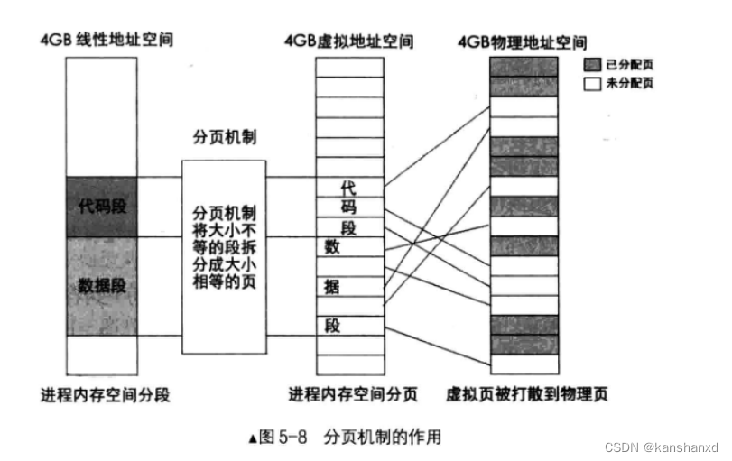
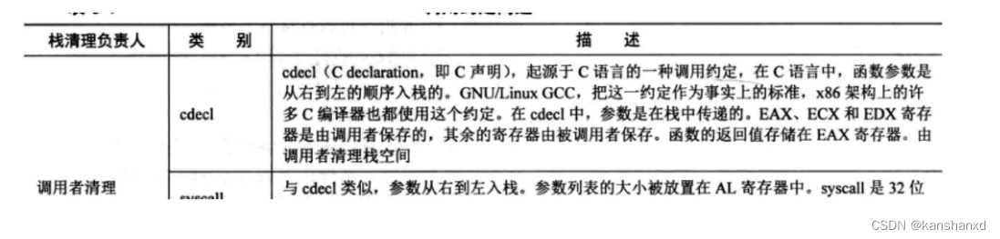
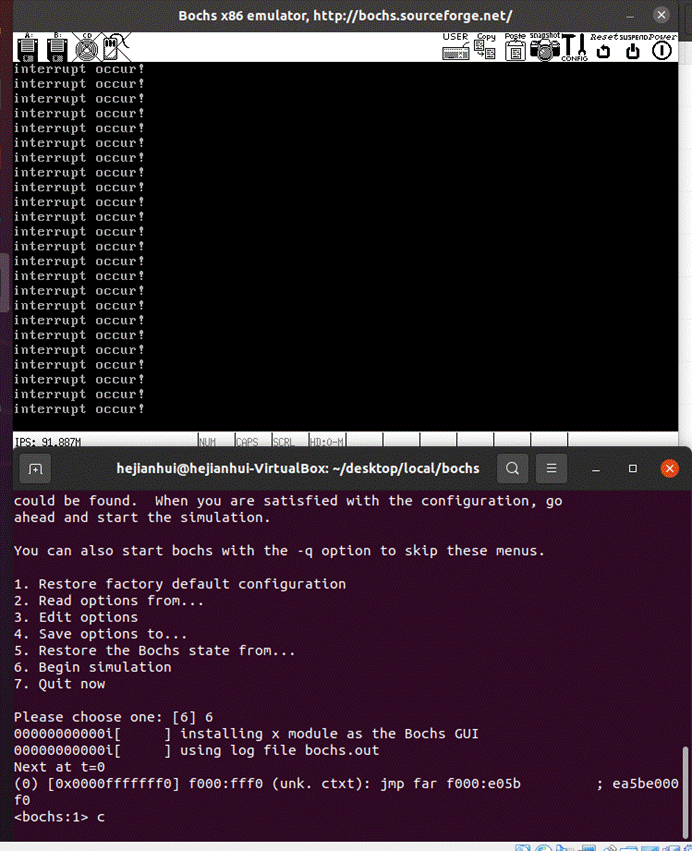

# 寄存器

- 段寄存器	CS DS SS ES
- 通用寄存器	16位:AX BX CX DX	32位:EAX
- 指令指针寄存器	IP
- 标志寄存器	
- 控制寄存器CR(control register)0-3	CR0 CR1 CR2 CR3 CR4


> 实模式下的地址线是 20 位,寻址空间多少?

20条线,即最大能表示2^20-1 = 1048575,寻址范围为0x00000~0xFFFFF(范围为1048576 = 1024*1024),

结合16位寄存器,可以实现1MB的寻址范围:

​	16 bits 的程序计数器首先从存储器中取得指令放入8 bits 的指令寄存器。

​	指令寄存器暂存放入的指令然后交给译码器取进行解析。

​	指令译码器将解析后的命令交给控制逻辑部件去执行操作。

​	我们知道存储器的内部结构是以字节形式组织的，所以cpu每次只能取得一条指令然后执行，接着重复上述操作，直至所有指令全部执行完毕。

​	这就是早期的串行结构设计。

-----

# 一些指令

- 编译main.c

  `gcc-4.4 -o build/main.o -c -m32 -I lib/kernel/ kernel/main.c`

- 编译print.S

  `nasm -f elf -o build/print.o lib/kernel/print.S`

- 编译kernel
  `nasm -f elf -o build/kernel.o kernel/kernel.S`

- 编译interrupt
  `gcc -I lib/kernel/ -I lib/ -I kernel/ -c -fno-builtin -o build/interrput.o -m32 kernel/interrupt.c`

- 编译init
  `gcc -m32 -I lib/kernel/ -I lib/ -I kernel/ -I device/ -c -fno-builtin -o build/init.o kernel/init.c`

- 编译timer
  `gcc -m32 -I lib/kernel/ -I lib/ -I kernel/ -I device/ -c -fno-builtin -o build/timer.o device/timer.c`

- ```sh
  nasm -I boot/include/ -o build/mbr.o boot/mbr.s
  nasm -I boot/include/ -o build/loader.o  boot/loader.s
  gcc-4.4 -o build/main.o -c -m32 -I lib/kernel/ kernel/main.c
  nasm -f elf -o build/print.o lib/kernel/print.S
  nasm -f elf -o build/kernel.o kernel/kernel.S
  gcc-4.4 -m32 -I lib/kernel/ -I lib/ -I kernel/ -c -fno-builtin -o build/interrput.o kernel/interrupt.c
  gcc-4.4 -m32 -I lib/kernel/ -I lib/ -I kernel/ -I device/ -c -fno-builtin -o build/init.o kernel/init.c
  gcc-4.4 -m32 -I lib/kernel/ -I lib/ -I kernel/ -I device/ -c -fno-builtin -o build/timer.o device/timer.c
  
  ----------------------  -fno-stack-protector
  
  gcc -I lib/kernel/ -fno-builtin -fno-stack-protector -o build/main.o -c -m32  kernel/main.c
  
  
  
  
  ```
  
  
  
- 链接成内核

  `ld -m elf_i386 -Ttext 0x00001500 -e main -o build/kernel.bin  build/main.o`

  `ld -m elf_i386 -Ttext 0x00001500 -e main -o build/kernel.bin build/main.o build/print.o` 

  `ld -m elf_i386 -Ttext 0x00001500 -e main -o build/kernel.bin build/main.o build/kernel.o build/init.o build/interrput.o build/print.o `

- `ld -m elf_i386 -Ttext 0x00001500 -e main -o build/kernel.bin build/main.o build/init.o build/interrput.o build/print.o build/timer.o build/kernel.o`


- 写mbr入硬盘

```sh
dd if=build/mbr.o of=hd60M.img bs=512 count=1 conv=notrunc
dd if=build/loader.o of=hd60M.img bs=512 count=4 seek=2 conv=notrunc
dd if=build/kernel.bin of=hd60M.img bs=512 count=200 seek=9 conv=notrunc

```


- 清除build文件夹内所有的编译好的二进制文件
  `rm -rf build/*`


- 启动bochs `bin/bochs -f bochsrc.disk`


# 二  MBR

## BIOS中断打印

> 用BIOS中断打印字符串


- 存放BIOS程序的ROM空间被映射到实模式下1MB内存的顶部，即地址0xF0000-0xFFFFF处，共64KB,其中顶部的**0xFFFF0~0xFFFFF**这16B空间是BIOS程序的入口地址

- 开机后CS:IP值，其值是0x0000:0x0000,指令地址就是**0x0000**。

  在实模式下CPU访问的内存是段地址+偏移地址的方式来实现的,所以0xF000:0xFFF0,访问的地址是**0xF000*16+0xFFF0=0xFFFF0**(20位地址线)

  BIOS程序开始运行

  1. 检测和初始化硬件；
  2. 建立中断向量表（即硬件I/O的操作）
  3. 校验启动盘中位于0盘0道1扇区(**其实是0扇区**)的内容（检测到末尾的两个字节分别是`0x55`和`0xaa`时，就认为该扇区存放MBR）

- 此代码通过改变寄存器的值,对应的调用多次INT 10H中断函数,来达到打印相应字符串的结果

- MBR只能放在0盘0道1扇区,去掉最后的两字节识别信息,实际上MBR只有510字节大小,它其实是不能胜任加载操作系统的工作的,而其实MBR的任务是加载loader,由loader加载操作系统

- 代码在`chapter_2/a`

- 代码开头`vstart=0x7c00`的原因,是由于它本身在`0x7c00`加载编译


----

## MBR使用显卡

> 让MBR使用显卡打印字符串


- 代码在`chapter_3/a`


-----

# 三 完善MBR

## MBR使用硬盘

> 让MBR使用硬盘,并启动内核加载器loader


**每个扇区有512字节**


本实验约定的操作顺序如下：

1. 先选择通道，往该通道的 sector count 寄存器中写入**待操作的扇区数**。
2. 往该通道上的三个 LBA 寄存器写入扇区起始地址的低 24 位。
3. 往 device 寄存器中写入 LBA 地址的 24～27 位，并置第 6 位为1 ，使其为 LBA 模式，设置第 4位，选择操作的硬盘（ master 硬盘或 slave 硬盘）。
4. 往该通道上的 command 寄存器写入操作命令。
5. 读取该通道上的 status 寄存器，判断硬盘工作是否完成。
6. 如果以上步骤是读硬盘，进入下一个步骤。否则，完工。
7. 将硬盘数据读出。

> 剖析mbr.S代码
>

**1、代码功能**

从磁盘中加载操作系统的loader，该loader由我们自己写入磁盘

**2、实现原理**

计算机发展到现在，已经将对磁盘的种种操作，简化成了对磁盘暴露在外的寄存器的操作，对这些寄存器的操作需要通过in与out指令

**3、代码逻辑**

A、清屏

B、通过对内存特定区域的操作显示字符

C、从磁盘特定区域读取特定大小的数据到特定内存位置中

**4、怎么写代码？**

A、include boot.inc，这里面定义了loader在磁盘中的位置（我们会将其写入磁盘2号扇区），与loader加载进入内存后将要存放的位置（在第二章的内存布局图中，找一个靠前的可用位置就行了，本代码用的是0x900）

B、定义vstart=0x7c00，调用bios中断清屏，对特定内存区域放入数据来显示字符

C、按照与磁盘打交道的7个步骤来完成从磁盘取出数据存放到内存指定区域（这7个步骤就是用in与out操作特定通道的寄存器）

E、跳转到内存中的loader位置执行

F、填充MBR要求的510字节剩下的0，定义MBR要求的标准结尾0x55，0xaa

(boot/include/boot.inc)

```assembly
;boot.inc
;-------------  loader 和 kernel  ----------------
LOADER_BASE_ADDR equ 0x900		;CHS地址
LOADER_START_SECTOR equ 0x2		;LBA地址
```

- 代码在`chapter_3/b`


-------

## 切入保护模式

> 实模式切入保护模式
>


> 代码loader.S剖析：


**1、代码功能**

启动保护模式后利用初始化的GDT表中的显存段描述符来对显存寻址后操作以显示字符

**2、实现原理**

IA32体系架构为了兼容8086，所以支持实模式，同时用保护模式提供更大的CPU寻址能力与访问安全性检查。刚开启电脑时，工作在实模式下。后面为了使用更好的性能而进入保护模式后，段基址寄存器的值不再作为实模式下的段基址，而是作为一个选择子，去GDT表中查询对应的段描述符以获得段基址与进行安全性检查，配合偏移来获得真实物理地址。

**3、代码逻辑（核心）**

A、初始化GDT表（就是定义要用到的段描述符）

B、利用BIOS中断打印字符串

C、打开保护模式，加载GDT表的基址进入GDTR寄存器

D、刷新流水线

E、加载显存段选择子，在保护模式下操作显存来显示字符

**4、怎么写代码？**

A、%include “boot.inc”；指定vstart=0x900；jmp到loader的可执行代码中去（因为loader中定义的GDT段描述符数据就直接会放在loader开头，而MBR最后会跳转到本程序开头来，数据不能被执行，我们要跳过它们）

B、利用已经在boot.inc中写好的模块化段描述符字段来拼凑出我们需要的代码段、数据段、显存段的段描述符。同时GDT表的第0项是全0，还要预留一些段描述符；然后定义显存段的选择子

C、查询BIOS中断打印字符串"2 loader in real"

D、开启保护模式：1、打开A20地址线（原因是因为8086存在高端内存，这部分内存只在逻辑中存在，物理中并没有对应。由于8086只有20根地址线，所以访问高端内存会自动丢掉最高位，所以并没有问题，当时很多程序员就利用这个特性偷懒。但是当后续CPU多了地址线后，之前8086偷懒程序员写的程序就会真的访问对于8086来说的高端内存。所以为了兼容他们的程序，就用A20地址线来控制是否能够访问更多的内存。用in与out指令就能与A20交互）；2、加载GDT表的首地址进入GDTR；3、将CR0寄存器的pe位置为1，意为打开保护模式（mov指令即可）

E、通过远跳转来刷新流水线

F、加载显存段选择子，切换32位编译，然后向显存段内存入数据来显示字符’P’

- 代码在`chapter_4/a`


> 命令

loader 615B

mbr	 512B

写loader入硬盘 要把count改成4,直接一步到位,因为这个时候loader已经超过512B了。

而且`dd`命令有个特性,你的`count`写的多大也好他会自己判断你本身文件的大小,所以说你的`count`写上一千一万都没事

`dd if=./loader.bin of=./hd60M.img bs=512 count=3 seek=2 conv=notrunc`

编译后，我们发现loader的大小已经超过我们的之前写的MBR设定加载的512B，所以我们修改MBR相关字段（修改与硬盘打交道7步骤中的第1步读取扇区数放入cx中的值，为了后面方便我们都改成4）

boot/mbr.S

```assembly
mov cx,4			            ; 待读入的扇区数
```


## BIOS获取内存

> 利用BIOS中断0x15子功能获取内存并进行内存容量检测

1. 内存容量检测

​		BIOS 0x15 中断把要调用的功能指定放在寄存器ax中，因此子功能号要存放到寄存器 EAX 或 AX 中，如下：

- EAX=0xE820：遍历主机上全部内存。返回的是内存布局，信息量多一些。

- AX =0xE801 : 分别检测低1MB和 16MB～4GB 的内存，最大支持 4GB。
- AH=0x88 ：最多检测出 64MB 内存，实际内存超过此容量也按64MB 返回。


剖析loader.S代码：

**1、代码功能（核心）**

获取内存总容量

**2、实现原理（核心）**

在实模式下调用BIOS中断获得内存容量，然后将信息存储在内存中

**3、代码逻辑（核心）**

A、调用BIOS中断0x15子功能0xe820获取内存总容量，若不成功则跳至B

B、调用BIOS中断0x15子功能0xe801获取内存总容量，若不成功则跳至C

C、调用BIOS中断0x15子功能0x88获取内存总容量

**4、怎么写代码？（核心）**

注：在第4章最后一版loader.S基础之上（进入保护模式前）加获取内存容量的代码

A、按照BIOS中断返回类型的数据结构来开辟内存空间来存储中断获取到的信息

B、查询中断使用用法(书p178)，调用BIOS中断0x15子功能0xe820获得内存的ARDS结构体，不调用0xe801与0x88中断（懒）

C、遍历获得的ARDS结构体，将所有结构体中的BaseAddrLow与LengthLow相加，冒泡选择值最大的就是内存的大小

boot/loader.s

删除*/boot/loader.S* 的[jmp](https://so.csdn.net/so/search?q=jmp&spm=1001.2101.3001.7020)指令，

bin/mbr.s

修改**myos/boot/mbr.S** 的[jmp](https://so.csdn.net/so/search?q=jmp&spm=1001.2101.3001.7020)指令，跳转位置 + 0x300，使之能跳转至loader.S中的loader_start

```assembly
   jmp LOADER_BASE_ADDR + 0x300
```

- 代码在`chapter_5/a`


按`ctrl+shift+c`暂停,然后`xp 0xb00`(exam print)

功能: 打印该地址的数据,一次性打印4B(32bits)数据


-----

# 四 分页机制

> 分页机制

## 建立分页

分段模型最大的缺点就是每个段大小不一，带来内存管理的困难（例子查看书P186）。所以需要通过固定大小且比一般段更小的块管理来代替原有的段管理，这就引出了分页机制。而且正是由于分页机制的引入，原有CPU设计者所设想的那种分段机制就基本被弃用，如现代操作系统都用平坦模型，抛弃了原来的那种在内存中分段管理的思路。

分页机制的核心就是，将程序所要用的虚拟内存空间（也就是32位编程时给程序分配的空间）与实际用到的内存空间分离。将程序所要用到的虚拟内存空间，拆分成一个个固定大小的小块（虚拟的，4K），与物理内存上的固定大小的小块建立映射关系。就是这样的一种分离，带来了内存管理的粒度更小（原有的段机制下段可能远比4K大得多）、粒度更标准（段大小不一，现在统一成了4K大小）、更灵活（将程序暂时用不到的小块不放入内存中，等用到了再从磁盘中调入）等优点。



为了向前兼容，之前段机制无法绕过（硬件决定好了要更大的寻址空间就必须要开启保护模式（段机制）），所以这分页机制只能在原有的段机制下开启。原有段机制得到的地址被重新命名为线性地址，需要经过页机制的处理得到物理地址，具体做法就是用段机制下得到的线性地址查询页表找到内存上的页。


为了平衡管理整个进程（页表是以进程为单位分配）的页表的表项数量与整个页表大小的关系，最终选择了一个页表1M项，整个页表4MB（一个表项4B）。由于页表管理的是整个进程的虚拟地址空间，所以4GB内存大小（32位程序编程时，程序员都是按照可以完全使用4GB内存来编写，只不过这种完全式的使用根本不会真的给它，所以这个4GB内存空间实际上是虚拟的）对应1M表项的话，那么一个表项就管理4KB大小的虚拟地址空间。

为什么每个进程都需要独立的页表？其根本原因是32位程序编程时，程序员都是按照可以独占使用4GB内存编写，所以每个进程都想完全使用4GB内存。如果要用一个页表统一管理所有进程，那么就必须要有可以管理N（程序数量）*4GB内存空间的页表，但这页表对应的内存不可能有这么大。且这么大的内存出现后，之后的程序编程就会按照可以这么大的内存做基础，这又需要管理N*大于4GB的页表，然后循环…所以只能采取每个进程使用独立的页表，让他们假装可以使用4GB内存，然后再用某种机制只分配给他们“够用”的内存，而非4GB完全内存。这样的话，所有进程的页表所占总空间就是N（程序数量） *4MB，这又是一个不小的开销。所以采用二级页表的做法，让一级页表只有1024个页表项（每个页表项管理4MB空间，一级页表开销4KB），一级页表1024个页表项对应1024个二级页表，每个二级页表管理着4MB空间，然后每个二级页表都有1024个表项，每个二级页表表项管理着4KB的空间。当程序用到某4MB空间时候，才会为它建立对应的二级页表。这就达到了节省页表开销空间的目的。

分段机制下产生的线性地址通过分页机制转换到真实物理地址查看书p194。

页目录项与页表项结构如下图：（各字段含义查看书P196）


现在我们编写代码，进行一些页表的初始化工作：

> 剖析loader.S代码
>

**1、代码功能**

一些页表的初始化工作

**2、实现原理**

硬件层面本就提供了分页机制，我们只需要进行页表的一些初始化工作，然后开启分页机制（硬件层面）即可

**3、代码逻辑（核心）**

A、将页目录表位置预留出来（创建0）

B、初始化一个页目录表（一级页表）

C、初始化第一个页表（二级页表）

**4、怎么写代码？**

A、先在boot.inc中定义页目录表的起始位置（放在内存1MB开始的位置），与定义模块化的页目录项与页表项字段；在上一版所写的loader.S中加入我们的创建页表函数。

B、在页目录表的位置初始化0。

C、页目录表0号项与768号项均指向第一个页表——0号项指向第一个页表（loader这个程序会运行在0-4M空间内，且跨越了段机制与页机制，顺序映射（第一个页表映射0开始4MB，第二个页表映射紧挨着下一个4MB空间）可以保证之前段机制下的线性地址和分页后的虚拟地址对应的物理地址一致，在这4M空间内，分段下的线性地址=分页后的虚拟地址=物理地址），768号项指向第一个页表是为了让分页机制下3GB开始的4MB虚拟地址空间（虚拟地址0-3G空间用户用，3-4G空间操作系统用）对应到了0-4M实际物理空间，因为这里放着我们的操作系统。这是为了所有进程共享操作系统做准备。页目录表最后一项1023号项指向自己——为的是将来动态操作页表做准备（后面章节会详细讲到）。

D、初始化第一个页表（非页目录表）——因为这个页表管理着0—4M的物理地址空间，我们的操作系统就在这个空间内。

E、初始化页目录表769号-1022号项，769号项指向第二个页表（此页表紧挨着上面的第一个页表），770号指向第三个，以此类推，——为将来用户进程做准备，使所有用户进程共享内核空间（从768号项—1022号项的页目录表项会被拷贝到所有用户进程的页目录表项中）；

**boot.inc中加入如下代码 (include/boot.inc)**

```assembly
PAGE_DIR_TABLE_POS equ 0x100000                     ;页目录表在内存中的起始位置——从1M开始的位置

                                                    ;---------模块化的页目录表字段,PWT PCD A D G AVL 暂时不用设置   ----------
PG_P  equ   1b
PG_RW_R	 equ  00b 
PG_RW_W	 equ  10b 
PG_US_S	 equ  000b 
PG_US_U	 equ  100b  
```

**boot/loader.s**	加入setup_page代码段

----

## 插入字符

进行完初始化部分页目录表与页表工作之后，我们现在就要正式开启页机制了。我们之前已经将我们操作系统实际所在的物理地址空间0——4M与虚拟地址空间3G开始4M建立了映射关系，所以我们访问虚拟地址空间3G开始的4M空间，实际上访问的是物理地址空间0——4M，也就是我们的操作系统。

在分页机制下，我们现在要让访问物理0——4M空间的用户进程代码去访问3G开始的4M虚拟地址空间，这是为了将虚拟地址空间0——3G给应用进程使用（我们上面代码中页目录表的768-1022号项会拷贝到所有进程的页目录表中，不会拷贝0号项）。我们之前在分段机制下是通过选择子的方式查找GDT表中的段描述符来访问物理地址，所以我们需要通过修改GDT表中的段描述符实现上述重定位访问。同时由于访问GDT表不是通过GDT表中的段描述符，而是通过GDTR中的值，所以我们也需要修改GDTR中的值，让进程通过GDTR中的值找GDT的时候不是去物理内存0——4M空间找，而是去虚拟地址3G开始的4M找（不修改的话，要想让GDT表正常工作，需要将用户进程自己的页目录表第0项与物理地址0——4M建立映射关系，此时GDTR中存储的GDT线性地址才能转换成正确的GDT物理地址）

> 剖析loader.S代码：
>

**1、代码功能**

开启页表机制，在页机制下显示一个字符

**2、实现原理**

操作系统是一个高度和硬件相关的程序，在硬件层面IA32体系就提供了页机制的支撑

**3、代码逻辑**

A、创建页目录表与第一个页表

B、GDT中的视频段描述符、GDT表基地址、栈指针地址升高

C、开启页机制

D、重载GDT表

E、操作显存段显示字符

**4、怎么写代码？**

A、调用之前写好的setup_page完成页目录表与页表的创建

B、GDT中的视频段描述符表地址+3G 、GDT表基地址+3G、栈指针地址+3G

C、开启页机制二步骤

将页目录表地址写入控制寄存器CR3
将CR0寄存器的PG位置为1
D、重新加载GDT地址

E、操作显存段显示字符


**boot/loader.s**中加入如下代码

```assembly
call setup_page                                     ;创建页目录表的函数,我们的页目录表必须放在1M开始的位置，所以必须在开启保护模式后运行

                                                    ;以下两句是将gdt描述符中视频段描述符中的段基址+0xc0000000
mov ebx, [gdt_ptr + 2]                              ;ebx中存着GDT_BASE
or dword [ebx + 0x18 + 4], 0xc0000000               ;视频段是第3个段描述符,每个描述符是8字节,故0x18 = 24，然后+4，是取出了视频段段描述符的高4字节。然后or操作，段基址最高位+c
                                       
add dword [gdt_ptr + 2], 0xc0000000                 ;将gdt的基址加上0xc0000000使其成为内核所在的高地址

add esp, 0xc0000000                                 ; 将栈指针同样映射到内核地址

mov eax, PAGE_DIR_TABLE_POS                         ; 把页目录地址赋给cr3
mov cr3, eax
                                                    
mov eax, cr0                                        ; 打开cr0的pg位(第31位)
or eax, 0x80000000  
mov cr0, eax
                                                  
lgdt [gdt_ptr]                                      ;在开启分页后,用gdt新的地址重新加载

mov byte [gs:160], 'V'                              ;视频段段基址已经被更新,用字符v表示virtual addr
```


-----

## 最终代码

- 代码在`chapter_5/b`

**boot/loader.s**

**boot/mbr.s**不变

**include/boot.inc**

> 命令

- `nasm -I include/ -o mbr.bin mbr.s`
-  `dd if=./mbr.bin of=./hd60M.img bs=512 count=1 conv=notrunc`

-  `nasm -I include/ -o loader.bin loader.s`
- `dd if=./loader.bin of=./hd60M.img bs=512 count=4 seek=2 conv=notrunc`
-  `../bin/bochs -f bochsrc.disk`

> 效果图


-----

# 五 进入内核

现在我们来完成loader最后一个使命，那就是将操作系统的二进制文件加载到内存中，根据elf文件头信息为其创建内核映像。

程序中最重要的部分就是段和节。program header用于描述每个段的信息，section header用于描述每个节的信息。由于程序中段与节的大小和数量是不固定的，所以program header与section header的数量大小也是不固定的，因此需要为它们专门找个数据结构来描述它们，这个描述结构就是program header table与section header table。但是，多一个段，就多一个program header，program header table就会变大，所以program header table与section header table的大小也是不固定的，就又需要一个elf header来描述program header table与section header table。

下图是编译好的操作系统的elf文件头格式，我们要从elf header中取得program header table的信息，又从program header table中得到关于对每个段program header的信息，根据这个信息去确定每个段的大小，起始地址，在内存中的目的地址（都是虚拟地址）


elf header结构如下，各字段大小与含义见书p215


program header table中每个program header的结构如下，大小与含义见书p217


> 剖析loader.S代码

**1、代码功能**

loader从磁盘中加载编译好的elf格式的kernel二进制文件，按照elf文件头的信息创建内核映像，然后执行内核代码。

**2、实现原理**

由于这个二进制文件是被编译好了的，是按照elf文件布局分布的，加载到内存中不能直接运行（有文件头）。我们要根据elf文件头的信息，将编译好了的文件中的各种段复制到内存中运行。具体来说，就是通过elf header得到program header table信息，然后根据program header table信息找到program header信息，该结构描述了各个段的起始偏移，大小，目的虚拟地址，根据这些信息将各个段复制到指定位置。最后跳入内核代码执行。

**3、代码逻辑**

A、把编译好了的kernel.bin从磁盘复制到内存指定位置

B、分析kernel.bin的elf文件头，找到各个段，然后将各个段复制到内存指定位置，这个位置是由于我们指定了内核可执行代码的入口0xc0001500后编译器根据实际代码情况自己指定的

**4、怎么写代码？**

A、在boot.inc中定义内核文件加载到内存中的位置：0x70000；定义内核文件在磁盘中的起始盘区：0x9；定义内核可执行代码的入口地址0xc0001500；把栈顶位置的宏定义从loader.S中移到boot.inc中。

B、写一个32位环境下读取磁盘的函数（这个函数我们直接去修改mbr.S中实现的16位读取磁盘的函数），然后传参调用此函数完成从磁盘中加载elf格式的内核文件到内存指定地址。

C、实现拷贝函数，用于将信息在内存中进行移动。

D、在boot.inc中定义program header type字段为空的宏，用此宏来判断program header描述的段是否需要被加载。

E、写一个解析elf文件的函数，该函数的功能：从指定位置的elf header中取出：1、program header table的偏移位置（加上内核文件在内存的起始位置就是物理地址），这为的是找到第一个program header；2、program header table中的program header（对于每个段的描述符）数量；3、program header table每个program header的大小。这三个信息为的是遍历每一个program header，如果该program header描述的段不是空段就从program header取出每个段的：1、段的大小；2、本段的偏移（加上内核文件在内存的起始位置就是物理地址）；3、段在内存中的虚拟地址（编译内核时我们会指定一个程序入口虚拟地址，编译器会根据指定的程序入口虚拟地址，计算出每个段虚拟地址。由于我们指定的虚拟地址就是真实加载的物理地址，所以取出的虚拟地址就是的段目的物理地址）。然后传参调用mem_cpy函数将段内容复制到指定位置。

F、调用E写的函数，完成内核映像的创建。然后跳入内核执行，删除显示字符’v’的代码与jmp $。

**5、代码实现如下**

- 代码在`chapter_5/c`

首先，我们先修改**(boot/include/boot.inc)**，增加一些宏定义

```assembly
LOADER_STACK_TOP equ LOADER_BASE_ADDR               ;这一条之前是在loader.S中定义，现在搬过来了

KERNEL_BIN_BASE_ADDR equ 0x70000                    ;定义内核在内存中的缓冲区，也就是将编译好的内核文件暂时存储在内存中的位置
KERNEL_START_SECTOR equ 0x9                         ;定义内核在磁盘的起始扇区
KERNEL_ENTRY_POINT equ 0xc0001500                   ;定义内核可执行代码的入口地址
```

由于我们现在是在32位环境下工作（开启了段页机制），因此之前我们写的mbr加载loader函数`rd_disk_m_16`不能直接用，得增加`rd_disk_m_32`（**boot/loader.S**）

然后调用我们之前写好的加载函数，去加载磁盘中编译好的内核文件到指定内存位置（**boot/loader.S**）

接下来就是要去解析elf内核文件，根据program header信息加载段，在此之前我们还需要实现一个拷贝函数，用于将数据从内存中一个位置拷贝置另一个位置（**boot/loader.S**）

还需在（**myos/boot/include/boot.inc**）中定义程序的段类型，也就是program header中的type字段，用于判断该段是否应该被加载

```assembly
                                                    ;-------------  程序段的 type 定义   --------------
PT_NULL equ 0
```

写一个函数`kernel_init`解析内存中的编译好的elf内核文件，创建内核映像**（myos/boot/loader.S）**

loader使命正式结束，接下来就是跳转进入内核开始执行（**myos/boot/loader.S**）

```assembly
    lgdt [gdt_ptr]                                      ;在开启分页后,用gdt新的地址重新加载

enter_kernel:    
    call kernel_init
    mov esp, 0xc009f000
    jmp KERNEL_ENTRY_POINT                              ; 用地址0x1500访问测试，结果ok
```

删除（**myos/boot/loader.S**）以下代码（原`lgdt [gdt_ptr]`下面代码）

```assembly
    mov byte [gs:160], 'V'                              ;视频段段基址已经被更新,用字符v表示virtual addr

    jmp $
```

**测试的kernel.c代码： (myos/kernel/kernel.c)**

```c
int main()
{	
    while(1);
    return 0;
}
```


由于我们自带的gcc版本是9.4.0，而书上是gcc4.6.1，现在需要将我们的gcc版本降低，否则后面会出现非常多难以解决的问题.

[ubuntu 16.04 gcc高低版本切换_总会习惯的博客-CSDN博客](https://blog.csdn.net/wu11zhike/article/details/83865549?utm_medium=distribute.pc_relevant.none-task-blog-2~default~BlogCommendFromMachineLearnPai2~default-4.control&depth_1-utm_source=distribute.pc_relevant.none-task-blog-2~default~BlogCommendFromMachineLearnPai2~default-4.control)

`gcc-4.4 /home/rlk/Desktop/the_truth_of_operationg_system/chapter_5/c/kernel/main.c -o /home/rlk/Desktop/kernel -c -m32`
-m 因为我们的虚拟机是32位的，所以必须将我们的内核文件编译成32位的；-c 是生成当前文件的二进制文件，不要进行链接）

`ld /home/rlk/Desktop/kernel -Ttext 0xc0001500 -e main -o /home/rlk/Desktop/kernel.bin -m elf_i386`

-Ttext 指定编译起始虚拟位置，-e 指定函数入口，-m 指定模拟的链接环境

`dd if=/home/rlk/Desktop/kernel.bin of=/home/rlk/Desktop/bochs/hd60M.img bs=512 count=200 conv=notrunc seek=9`

我们的内核文件就是一个死循环，在虚拟内存的0xc0001500开始！

CPL、DPL、RPL总结

CPU总是在执行代码，代码总是处于某个段中，CS有自己的值，CS中的RPL位就是CPU当前的CPL。当这一段代码想要跳转到另一段代码中执行时，就需要加载另一段代码的选择子去GDT中查找对应的段描述符，段描述符中有被访问代码的DPL值，CPU就根据当前的CPL，与目的代码段的DPL做比较，来进行访问限制实现安全检查。理论上CPL<=DPL（数值）才能访问某个段，但实际上只允许平级访问。因为特权级低代码能做的事情，高特权级代码也能做。所以根本不会出现由特权级高代码切换到特权级低代码这种情况（除了中断返回）。而且特权级低代码肯定不能直接切换到特权级高的代码，自然就只能平级访问。但是仅仅依靠CPL与DPL是不够的，典型场景就是一个应用通过系统调用去操作操作系统的数据，在这种情况下是绝对不允许的。因此又引入了RPL，RPL是这个应用要加载的段描述符选择子的RPL位的值，比如刚刚那个场景，应用为了操作操作系统的数据，那么加载到ds中的段描述符选择子的RPL是0，但是应用此时的CPL是3，因此CPU就能通过CPL与RPL的差异来判断应用想要搞鬼，所以就会强行将加载到ds中的段描述符的选择子的RPL改为应用的CPL。参见这篇文章：[**Link**](https://zhuanlan.zhihu.com/p/410107674)

CPU的初始CPL是在保护模式开启时（只有保护模式开启时，才有特权级这一概念）初始化的。因为当我们BIOS加载MBR，MBR加载loader并执行时，需要用到一句jmp 0:loader_start，后面保护模式开启后，现在的CS值是全0（虽然这是个非法段描述符选择子），我们需要用jmp SLE_CODE:p_mode_start，来刷新流水线，CPU会将当前的CS（值为全0）当做一个段描述符选择子，其中的RPL是0，也就是CPU的CPL是0，然后将SLE_CODE作为选择子查段描述符，对应的段描述符（我们设置的）中的DPL为0，cpu允许跳转。然后跳转之后的段的CS值的RPL，又成为当前CPU的CPL，这样CPL就被初始化为0了。

一致性代码段能够实现低特权级访问高特权级，但不会改变CPU的CPL，cpu的CPL仍然以访问前的低特权级代码的RPL。所以一致性代码段的DPL实际上是访问特权级的上限。也就是DPL=1，那么CPL=1,2，3都可以访问（=0应该也可以访问，只是一般没必要）。

同样的逻辑可以用于eflags的IOPL位，与IO位图来实现应用对端口（硬件）操作的安全性检查。

s中的段描述符的选择子的RPL改为应用的CPL。参见这篇文章：[**Link**](https://zhuanlan.zhihu.com/p/410107674)

CPU的初始CPL是在保护模式开启时（只有保护模式开启时，才有特权级这一概念）初始化的。因为当我们BIOS加载MBR，MBR加载loader并执行时，需要用到一句jmp 0:loader_start，后面保护模式开启后，现在的CS值是全0（虽然这是个非法段描述符选择子），我们需要用jmp SLE_CODE:p_mode_start，来刷新流水线，CPU会将当前的CS（值为全0）当做一个段描述符选择子，其中的RPL是0，也就是CPU的CPL是0，然后将SLE_CODE作为选择子查段描述符，对应的段描述符（我们设置的）中的DPL为0，cpu允许跳转。然后跳转之后的段的CS值的RPL，又成为当前CPU的CPL，这样CPL就被初始化为0了。

一致性代码段能够实现低特权级访问高特权级，但不会改变CPU的CPL，cpu的CPL仍然以访问前的低特权级代码的RPL。所以一致性代码段的DPL实际上是访问特权级的上限。也就是DPL=1，那么CPL=1,2，3都可以访问（=0应该也可以访问，只是一般没必要）。

同样的逻辑可以用于eflags的IOPL位，与IO位图来实现应用对端口（硬件）操作的安全性检查。


------

# 六 完善内核

## 字符打印



接下来我们实现一个简单的打印函数，不过为了开发方便，我们先要定义一些数据类型 (**/lib/stdint.h**)

```c
#ifndef __LIB_STDINT_H
#define __LIB_STDINT_H
typedef signed char int8_t;
typedef signed short int int16_t;
typedef signed int int32_t;
typedef signed long long int int64_t;
typedef unsigned char uint8_t;
typedef unsigned short int uint16_t;
typedef unsigned int uint32_t;
typedef unsigned long long int uint64_t;
#endif
```

> 剖析print.s代码： 

(myos/lib/kernel/print.S)

**1、代码功能**

写一个实现打印功能的汇编代码编译进入内核，来实现我们常见的显示字符功能

**2、实现原理（核心）**

A、通过对显存段操作，我们能够在屏幕上显示字符

B、通过与显卡寄存器打交道，我们可以获得光标位置，结合原理1，能够实现我们平常见的那种在光标处显示字符，然后光标向后移动的效果。光标位置需要与VAG寄存器（显卡的寄存器）中CRT Controller Registers组中索引号为0Eh与0Fh寄存器来打交道。详见p262


**3、代码逻辑**

判断输入字符，对不同情况作出对应处理

4、怎么写代码？（代码完整实现的思路）

A、保存调用者的执行环境

B、加载显存段选择子（要自己定义），显示字符就是对显存进行操作

C、通过与显卡寄存器打交道，获得光标位置

D、通过栈来取出传入的参数（调用者传入的字符）

E、判断D取出的字符：

a、回车，光标位置移置行首
b、换行，光标位置移置下一行行首（仿照linux系统做法\r,\n,\r\n的区别 - 荷树栋 - 博客园 (cnblogs.com)）
c、退格，光标位置向前移动，并且显示一个空格（来实现我们期待的删除一个字符的功能）
d、其他，根据当前光标位置确定显存位置，然后显示后光标后移
F、E中A，B，D都有可能造成字符超出第一页显示范围，所以我们需要实现滚屏功能（采取p270方案2）

G、恢复调用者执行环境

**5、代码实现如下：** 

- 代码在`chapter_6/a`

为了方便其他函数调用我们写的print，所以我们为其建立一个头文件 myos/lib/kernel/print.h

```c
#ifndef __LIB_KERNEL_PRINT_H
#define __LIB_KERNEL_PRINT_H
#include "stdint.h"     //我们的stdint.h中定义了数据类型，包含进来
void put_char(uint8_t char_asci);      //在stdint.h中uint8_t得到了定义，就是unsigned char
#endif
```

接下来验证我们的打印函数是否能正常工作，编写一个内核文件 myos/kernel/main.c


-----------------

## 字符串打印

> 剖析代码：
>

**1、代码功能**

打印字符串

**2、实现原理**

C语言我们定义字符串时，会为字符串最后加上ascii 为0的字符表示字符串的结尾，我们可以通过传入字符串首地址，然后通过字符串首地址取出字符，不断判断这是不是ascii码为0的字符来判断是不是结尾，如果不是就打印字符

**3、代码逻辑**

打印字符串中每个字符，到结尾就结束

4、怎么写代码？(1、在print.h中加上我们的函数申明，这样写包含头文件就能引用我们写的函数；2、在print.S中加入我们打印字符串的代码)

A、保存执行环境

B、从栈中取出调用者传入的字符串首字符地址

C、判断B取出的首地址，取出字符串字符，判断是不是ascii码为0的字符，如果不是就调用之前写好的打印字符的函数，如果是就结束

D、恢复执行环境

**5、代码实现如下：**

- 代码在`chapter_6/b`

print.s中加入如下代码： myos/lib/kernel/print.S

```assembly
[bits 32]
section .text
                                                            ;--------------------------------------------
                                                            ;put_str 通过put_char来打印以0字符结尾的字符串
                                                            ;--------------------------------------------
                                                            ;输入：栈中参数为打印的字符串
                                                            ;输出：无

global put_str
put_str:
                                                            ;由于本函数中只用到了ebx和ecx,只备份这两个寄存器
   push ebx
   push ecx
   xor ecx, ecx		                                        ; 准备用ecx存储参数,清空
   mov ebx, [esp + 12]	                                    ; 从栈中得到待打印的字符串地址 
.goon:
   mov cl, [ebx]                                            ;ebx是字符串的地址，对地址进行取地址操作，然后取出一字节的数据，就是取出了字符串的第一个字符
   cmp cl, 0		                                        ; 如果处理到了字符串尾,跳到结束处返回
   jz .str_over
   push ecx		                                            ; 为put_char函数传递参数
   call put_char
   add esp, 4		                                        ; 回收参数所占的栈空间
   inc ebx		                                            ; 使ebx指向下一个字符
   jmp .goon
.str_over:
   pop ecx
   pop ebx
   ret
```

print.h中加入如下代码： myos/lib/kernel/print.h

``` c
void put_str(char* messags);
```

写一个新的内核来验证一下： myos/kernel/main.c

```c
#include "print.h"
void main(void) {
   put_str("I am kernel\n");
   while(1);
}
```


-----------------

## 整数打印

> 剖析代码：
>

**1、代码功能**

将一个值转换成字符显示出来

**2、实现原理**

数值的9需要转换成字符9对应的ASCII码值，才能用于显示。用待转换的数值减去各自的起始数字（如0或10）获得其对应字符相对于0字符或A字符的偏移量，再用此偏移量加上对应字符所在类别的起始字符ASCII码（如0或A的ascii码值），就是该数字对应的字符的ascii码值（实例见p279）

**3、代码逻辑**

将一个32位的值，从最低处开始，按照4位一组处理（因为每4位对应16进制的一位）成对应字符，倒着放入缓冲区。处理好前缀之后（出现连续的0需要跳过），一个一个打印出来

**4、怎么写代码？**

A、定义一个8字节的缓冲区，8字节是因为一个完整的32位值每次取四位转换成一个字符（1字节），需要8次。

B、保存执行现场

C、循环取32位值每4位，从最低4位开始取，转换成对应字符的ASCII码值，然后倒着存在缓冲区中

D、对于C的结果，不显示转换后从高位开始连续的字符0，如00123，显示123；如果是全0，则需要只显示一个0

E、恢复执行现场

**5、代码实现如下：**

- 代码在`chapter_6/c`

print.s加入如下代码 myos/lib/kernel/print.S

```assembly
section .data
put_int_buffer dq 0                                         ; 定义8字节缓冲区用于数字到字符的转换

global put_int
put_int:
   pushad
   mov ebp, esp
   mov eax, [ebp+4*9]		                                ; call的返回地址占4字节+pushad的8个4字节，现在eax中就是要显示的32位数值
   mov edx, eax                                             ;edx中现在是要显示的32位数值
   mov edi, 7                                               ; 指定在put_int_buffer中初始的偏移量，也就是把栈中第一个字节取出放入buffer最后一个位置，第二个字节放入buff倒数第二个位置
   mov ecx, 8			                                    ; 32位数字中,16进制数字的位数是8个
   mov ebx, put_int_buffer                                  ;ebx现在存储的是buffer的起始地址

                                                            ;将32位数字按照16进制的形式从低位到高位逐个处理,共处理8个16进制数字
.16based_4bits:			                                    ; 每4位二进制是16进制数字的1位,遍历每一位16进制数字
   and edx, 0x0000000F		                                ; 解析16进制数字的每一位。and与操作后,edx只有低4位有效
   cmp edx, 9			                                    ; 数字0～9和a~f需要分别处理成对应的字符
   jg .is_A2F 
   add edx, '0'			                                    ; ascii码是8位大小。add求和操作后,edx低8位有效。
   jmp .store
.is_A2F:
   sub edx, 10			                                    ; A~F 减去10 所得到的差,再加上字符A的ascii码,便是A~F对应的ascii码
   add edx, 'A'

                                                            ;将每一位数字转换成对应的字符后,按照类似“大端”的顺序存储到缓冲区put_int_buffer
                                                            ;高位字符放在低地址,低位字符要放在高地址,这样和大端字节序类似,只不过咱们这里是字符序.
.store:
   mov [ebx+edi], dl		                                ; 此时dl中是数字对应的字符的ascii码
   dec edi                                                  ;edi是表示在buffer中存储的偏移，现在向前移动
   shr eax, 4                                               ;eax中是完整存储了这个32位数值，现在右移4位，处理下一个4位二进制表示的16进制数字
   mov edx, eax                                             ;把eax中的值送入edx，让ebx去处理
   loop .16based_4bits

                                                            ;现在put_int_buffer中已全是字符,打印之前,
                                                            ;把高位连续的字符去掉,比如把字符00000123变成123
.ready_to_print:
   inc edi			                                        ; 此时edi退减为-1(0xffffffff),加1使其为0
.skip_prefix_0:                                             ;跳过前缀的连续多个0
   cmp edi,8			                                    ; 若已经比较第9个字符了，表示待打印的字符串为全0 
   je .full0 
                                                            ;找出连续的0字符, edi做为非0的最高位字符的偏移
.go_on_skip:   
   mov cl, [put_int_buffer+edi]
   inc edi
   cmp cl, '0' 
   je .skip_prefix_0		                                ; 继续判断下一位字符是否为字符0(不是数字0)
   dec edi			                                        ;edi在上面的inc操作中指向了下一个字符,若当前字符不为'0',要恢复edi指向当前字符		       
   jmp .put_each_num

.full0:
   mov cl,'0'			                                    ; 输入的数字为全0时，则只打印0
.put_each_num:
   push ecx			                                        ; 此时cl中为可打印的字符
   call put_char
   add esp, 4
   inc edi			                                        ; 使edi指向下一个字符
   mov cl, [put_int_buffer+edi]	                            ; 获取下一个字符到cl寄存器
   cmp edi,8                                                ;当edi=8时，虽然不会去打印，但是实际上已经越界访问缓冲区了
   jl .put_each_num
   popad
   ret
```

print.h中加入函数申明 myos/lib/kernel/print.h

```c
void put_int(uint32_t num);	        // 以16进制打印
```


编写main.c代码来检验 myos/kernel/main.c

```c
#include "print.h"
void main(void) {
   put_str("I am kernel\n");
   put_int(0);
   put_char('\n');
   put_int(9);
   put_char('\n');
   put_int(0x00021a3f);
   put_char('\n');
   put_int(0x12345678);
   put_char('\n');
   put_int(0x00000000);
   while(1);
}
```


-----------

# 七 中断

## 初探中断

中断就是发生了事情通知CPU，但是处不处理就看情况。中断机制的本质是来了一个中断信号后，cpu去处理，然后调用相应的中断处理程序。

外部中断:

来自CPU外部的中断，因为外部中断源必须是某个硬件，所以也叫硬件中断。CPU为外部中断提供了两条信号线，如下图：


- 从INTR引脚接收到的中断信号都是不影响系统运行的，可以随时处理，所以是可屏蔽的，也叫可屏蔽中断，每个中断都有中断向量号。


- 从NMI引脚，全是对系统运行有致命伤害的，所以是不可屏蔽的，自然叫不可屏蔽中断，共用一个中断向量号，为2。


- Linux把可屏蔽中断分为上半部分和下半部分，上半部分需要立即执行，下半部分可以推迟执行，例子见书p300。

内部中断：

- 软中断和异常，软中断是软件主动发起的。


- 异常是指令执行期间CPU内部产生的错误引起的，不可屏蔽。异常按照轻重程度分为：Fault（故障，可以被修复，比如缺页异常page fault），Trap（陷阱，软件掉进了CPU设下的陷阱，比如调试过程中用的int3），Abort（终止，一旦发生，操作系统为了自保只能将此程序从进程表中去掉）

异常和不可屏蔽中断的中断向量号是由CPU自动提供的，而来自外部设备的可屏蔽中断号是由中断代理提供的，软中断是由软件提供的。

当CPU接收到一个中断时，需要用中断向量在中断段描述符表中检索对应的描述符（中断门描述符），在该描述符中找到中断处理程序的起始地址（一个段描述符选择子与偏移），然后执行中断处理程序。

计算机为了实现对中断的高效管理，而引入了中断控制器，由它负责接收外部设备的中断，负责对所有中断进行仲裁，决定哪个中断优先被CPU受理。

接下来我们来实现一个简陋的时钟中断。大致流程如下图：


init_all函数用来初始化所有的设备及数据结构，我们打算在主函数中调用它来完成初试化工作。init_all首先调用idt_init，它用来初始化中断相关的内容，其初始化也要分成几部分来做，pic_init用来初始化可编程中断控制器8259A，idt_desc_init用来初始化中断描述符表IDT，最后再加载IDT。

**本节代码核心逻辑：**

1. 创建33个中断处理函数

2. 写函数构建中断描述符表
3. 写函数初始化中断控制器8295A，并只打开时钟中断
4. 把2和3封装进入中断始化函数idt_init，调用idt_init函数完成中断描述符表初始化与中断控制器初始化，并加载idtr寄存器的值
5. 把4封装进入总初始化函数init_all，调用这个函数完成中断初始化
6. 在main中打开中断测试
7. 首先我们先写好中断发生后的中断处理程序

> 剖析kernel.S代码：
>

**1、代码功能**

创建33个中断处理函数

**2、实现原理**

中断信号进入中断控制器进行处理之后，会被分配中断号，通过特定的中断号码，可以调用特地的中断处理程序去处理。0—19中断号为处理器内部固定的异常类型，20-31是Intel保留的。同时为了演示中断机理，写一个时钟中断处理程序，所以共33个。

**3、代码逻辑**

定义33个中断处理程序，每个程序包含处理部分与本程序的地址

**4、怎么写代码？**

A、定义没有压入错误码但为了统一管理需要压入0的宏参数；定义要压入错误码所以我们什么都不做的宏参数

B、定义一个文本段，里面放着要打印的字符串信息，然后定义一个标号（就在文本段下方）。由于编译器的特性，会将同一类型的SECTION组合成一个大的SEGMENT，所以D中调用宏所形成的每个中断处理程序中的入口地址部分（这个入口地址会被定义成文本段）会统一聚集在这个要打印的字符串这里（因为它是被定义成了文本段），也就是字符串信息下面的标号处，于是这个标号便可以管理所有的中断处理程序地址

C、定义一个中断处理程序宏，宏中包含程序段：程序处理部分（打印字符串信息）、文本段：本程序的入口地址部分

D、调用C定义的宏实现33个中断处理程序的定义（传不同的参数），要理清楚哪些中断要压入错误码，哪些中断不会压入错误码。不压入错误码的我们压入一串0，这样能实现中断统一定义（p303表7-1）

**5、代码实现如下：** 

- 代码在`chaptere_7/a`

myos/kernel/kernel.S

**以上代码的核心就是33个中断处理函数，并且这些中断处理函数的入口地址形成了一个数组。**

然后我们进行IDT表建构工作，核心就是为上文写下的中断处理函数建立对应的中断描述符表。下图是中断描述符的结构，字段含义参考段描述符


> 剖析interrupt.c代码：
>

**1、代码功能**

构建IDT表，为上文写下的中断处理函数建立对应的中断描述符表

**2、实现原理**

依据中断描述符表格式，将中断描述符表与中断处理函数建立映射

**3、代码逻辑**

创建33个中断门描述符结构体，然后通过循环将中断门描述符与特定中断处理函数建立映射

**4、怎么写代码？**

A、定义中断门描述符结构体，并定义一个中断门描述符结构体数组（33项）

B、写一个函数make_idt_desc，通过传入中断门描述符结构体指针，属性项，特定中断处理函数地址（通过引入intr_entry_table实现引用），将中断门描述符与特定中断处理函数建立联系

C、写一个函数idt_desc_init，循环调用B函数，完成构建中断描述符表

**5、代码实现如下：**

先定义内核用的段描述符选择子，中断门描述符attr字段 **（myos/kernel/global.h）**

接下来定义了一些数据类型（intr_handler） **（myos/kernel/interrupt.h）**

核心代码： **（myos/kernel/interrupt.c）**

接下来就是设定中断控制器。对任何硬件的控制都要通过端口，我们现在先把常用的端口读写功能利用内联汇编封装成C函数。这四个函数定义在io.h中，这样包含此.h文件就能够直接使用inline函数（原封不动展开，直接操作寄存器）。比一般的包含一个.h引入一个函数声明再链接一起要快得多，因为一般方式会涉及到call与ret指令。详细理由见p327 。内联汇编基础见p283

代码剖析略，具体代码如下： **（myos/lib/kernel/io.h)**

再次编写**interrupt.c**

> 剖析interrupt.c代码：
>

**1、代码功能**

设置中断控制器，对中断控制器操作，只接受来自时钟中断的信号

**2、实现原理**

CPU直接与中断打交道，不仅浪费CPU强大的性能，且CPU为了接收各种各样的中断信号，将会无比冗余（cpu将会有过多引脚），引入专门的中断控制器来先处理一下中断。我们需要先设置中断处理器（初始化），然后操作它来处理对应的中断信号。设置与操作都是通过它暴露在外的寄存器来进行。操作详情见p330

**3、代码逻辑**

初始化中断处理器

设定只接受时钟中断信号

**4、怎么写代码？**

**A、看书p315设定相应的ICW与OCW**

第一轮设定：（因为要按照ICW1-4的顺序推送，先主后从）

主片ICW1：00010001，0x11（送入主片控制端口）：

0号位为1，表示要写入ICW4，x86系统必须为1；
1号位为0，表示级联；
2号位为0，用于是设定8085的调用时间间隔，x86不需要设置；
3号位为0，表示边沿触发；
4号位为1，ICW1的标记；
高3位x86不需要设置，直接为0。
主片ICW2：00100000，0x20（送入主片的数据端口）：ICW2用来设置起始中断向量号，由于中断控制器上的IRQ接口是按顺序排列的，所以我们这里设定的实际就是IRQ0的中断向量号。这里我们设定32（也就是第33个中断向量号），因为前32个（0-31）已经被占用了。而且只需要填入高5位，也就是填一个8的倍数，然后8295A的8个IRQ接口就在此基础上顺序排号。如第一个主片，八个接口就是，IRQ0 = 32 + 0; IRQ1 = 32 + 1… 第一个从片就是IRQ0 = 32 + 8 + 0, IRQ1 = 32 + 8 + 1;

主片ICW3：00000100，0x04（送入主片数据端口）：8位中哪位置1，表示哪个IRQ与从片连接，前面的值表示主片的IRQ2用于与从片级联。

主片ICW4：00000001，0x01（送入主片数据端口）：

0号位为1，表示x86处理器；
1号位为0，表示手动结束中断（我们的中断处理程序中有通知主从片结束中断的步骤）；
2号位为0，因为3号位设定为0（非缓冲模式工作），所以此位无用；在非缓冲模式下，8259A的数据总线直接连接到系统总线上，而不是通过缓冲器。当中断发生时，8259A会直接向CPU发送中断信号，而不经过任何缓冲或处理。这种模式可能会使系统在处理大量的中断请求时表现得不那么稳定，因为它对系统总线的要求更高。然而，非缓冲模式的系统设计会更简单一些，因为不需要缓冲器的附加硬件。
4号位为0，表示全嵌套模式，也就是优先处理较低中断请求线编号的中断请求（IRQ0最优先），特殊全嵌套模式是可以允许在中断处理过程中，如果来了一个优先级更高的中断请求，就暂停当前正在执行的中断，转而去执行那个优先级更高的中断请求；
高3位无用。
第二轮设定：

从片ICW1：00010001，0x11（送入从片控制端口）：含义参照主片ICW1。

从片ICW2：00101000，0x28（送入从片的数据端口）：主片起始中断向量号是32，主片自己8个IRQ，所以从片自然从40开始。

从片ICW3：00000010，0x02（送入从片数据端口）：用来表明主片哪个IRQ与自己级联，前面的值表明是主片的IRQ2用于与自己级联。

从片ICW4：00000001，0x01（送入从片数据端口），含义参照主片ICW4。

设定只接受时钟中断的OCW1：

主片OCW1：11111110，0xfe（送入主片数据端口），我们先只打开时钟中断看看效果，而时钟中断在主片IRQ0上，所以OCW1的0号位置为0，表示放行IRQ0送入的中断信号。

从片OCW1：11111111，0xff（送入从片数据端口），从片中断信号全部屏蔽

B、将A设定好的按照P330步骤推送至中断控制器的特定寄存器（通过io.h中封装的函数），并封装成一个pic_init函数
**新加入的代码如下： （myos/kernel/interrupt.c）**

接下来我们就调用之前我们写好的函数，并定义加载到IDTR寄存器中的值（参照书P306图IDTR结构），并最终加载IDTR来完成整个idt的构建工作，并封装成一个函数idt_init。

**myos/kernel/interrupt.h中加入如下代码：**

```c
void idt_init(void);
```

**myos/kernel/init.c** 代码剖析略

```c
#include "init.h"
#include "print.h"
#include "interrupt.h"

/*负责初始化所有模块 */
void init_all() {
   put_str("init_all\n");
   idt_init();   //初始化中断
}
```

为了其他的函数调用我们的init_all，我们需要建立头文件init.h，声明函数init_all，其他的函数包含我们的头文件，就可以调用我们的函数

**myos/kernel/init.h** 代码剖析略

```c
#ifndef __KERNEL_INIT_H
#define __KERNEL_INIT_H
void init_all(void);
#endif
```

最后，我们来写一个main.c来验证我们的之前关于中断的所有工作的正确性

**myos/kernel/main.c** 代码剖析略

```c
#include "print.h"
#include "init.h"
void main(void)
{
    put_str("\nThis is Kernel!\n");
    init_all();
    asm volatile
    (
        "sti"   //为了演示中断，这里先临时开启中断
    );
    while(1);
    
}
```

> 我们程序的含义，就是每发生一次时钟中断，就打印一次信息！
>

之前所做的无非是为了演示中断机制的原理，非常简单，现在要完善中断处理机制。主要就是让每个中断都有自己对应的处理函数，而不是像我们之前那样只是打印一个字符串。

但是我们不太可能采取在汇编中（kernel.S）直接定义中断处理函数，原因：1、汇编编写太麻烦；2、用一个kernel.S来维护所有中断处理函数很不方便；所以我们需要这样一种机制：1、用C语言编写中断处理函数；2、当中断发生的时候，从我们之前写好的kernel.S中跳到我们C语言编写的中断处理函数中执行。接下来，我们来实现这样的机制。



--------

## 用C管理中断

**1、代码功能**

用C语言定义中断处理函数，然后形成一个中断入口地址表。按照之前定义好的中断处理机制，当中断发生时，系统会用中断号找到对应的中段描述符，然后跳往汇编中我们定义好的中断处理函数（之前是打印字符串）。现在修改这个汇编中的中断处理函数，让其只是做简单处理（如保存程序执行环境），然后调用之前C中形成的中断入口地址表找到C中定义的中断处理函数去执行。汇编中的中断处理部分与C中的中断处理部分关系如下：


**2、实现原理**

在原有中断处理机制上修改

**3、代码逻辑**

在C语言中定义中断处理函数，然后形成地址数组管理C语言中的中断处理函数；汇编通过C形成的地址管理数组去调用C中的中断处理函数

**4、怎么写代码？**

**在interrupt.c**中

A、建立一个地址数组用来存储中断处理函数的地址，一个字符串指针数组用来存储中断的名字

B、我们先写一个通用的中断处理函数，功能是打印中断向量号，参数是中断号码

C、将地址数组中每个元素初始化为B写的中断处理函数地址（后面再改）；将字符串指针数组对照中断号填入中断名字（书p303），并封装成一个函数execption_init()

D、在idt_init（用来完成中断初始化的函数）中，调用exception_init；

**在kernel.S**中

A、引入interrupt.c中定义的中断处理程序地址数组

B、中断处理函数模板中删除打印字符串的部分

C、中断处理函数模板中加入保存上下文代码

D、中断处理函数模板中加入<u>压入</u>中断号代码（方便调试）与调用C中形成的中断地址数组找到中断处理函数地址的代码

E、定义恢复上下文环境并退出中断的代码，并在D中调用

**5、代码实现如下：**

- 代码在`chapter_7/b`

**myos/kernel/interrupt.c**中加入代码：

**myos/kernel/kernel.S**修改代码：

编译，链接，写入。由于我们只是在原来的代码中新加入了一种管理机制，现在时钟中断仍然是开启的。当时钟中断发生后，系统会根据中断控制器提供的中断号码查询中断描述符，然后去执行中断描述符中的中断函数地址指向的汇编文件写成的中断函数。而汇编文件中的中断函数又通过call[IDT_TABLE+中断号*4]指令跳入C文件管理的中断处理函数中，这里我们初始化成了一个一般的中断处理函数（功能是打印中断号码）。

当发生中断时，处理器会自动压入eflags、cs、eip、error_code（如果有的话）。结合我们之前的代码，当中断发生时，会压入如下值在栈空间中


----------

## 加快中断频率

时钟是一种使设备间相互配合而避免发生冲突的节拍，可以分为外部时钟和内部时钟。内部时钟由晶体振荡器产生，是指处理器中内部元件，如运算器、控制器的工作时序，主要用于控制、同步内部工作过程的步调，是ns级，无法改变。外部时钟是指处理器与外部设备或外部设备之间通信时采用的一种时序，一般为ms或s级。外部时钟和内部时钟是两套独立运行的定时体系，所以当涉及计算机内部与外部配合工作时，就必须要协调二者的时钟，定时计数器就是用来做这个事情的。

外部定时有两种方法，一种是用软件实现（p347），但是会让处理器空转，浪费处理器资源；另一种是硬件实现，也就是定时计数器，其功能就是达到了所计数的时间，计数器可以自动发出一个输出信号，可以用该信号向处理器发出中断。分为可编程定时器与不可编程定时器两种。一般有两种计时方式，正计时与倒计时。

接下来我们编写代码，来提高时钟中断的频率

> 剖析timer.c代码：
>

**1、代码功能**

提高时钟中断的频率

**2、实现原理**

通过指定端口号，设置可编程定时器

**3、代码逻辑**

设置可编程定时器

**4、怎么写代码？**

A、往控制寄存器端口0x43中写入控制字（设置方法详见书p350）

SCI1位与SCI0位置为00，意为操作定时器0。因为个人计算机中，定时器0专用于时钟中断

RW1位与RW0位置为11，意为选择读写方式，这里选择先写入低字节，然后写入高字节

M2位、M1位与M0位置为10，意为设置工作方式，这里设置为比率发生器（p352）

BCD位置为0，意为指计数器的计数方式是二进制

B、在所指定使用的计数器端口（0x40）中写入计数初值，因为我们要设定每秒100个中断，所以初值为1193180/100

C、A与B封装成一个函数frequency_set，定义一个timer_init调用前者

D、然后将在init_all中调用timer_init

**5、代码实现如下**：

- 代码在`chapter_7/c`

**（myos/device/timer.c）**

```c
#include "timer.h" 
#include "io.h"
#include "print.h"

#define IRQ0_FREQUENCY	    100    //定义我们想要的中断发生频率，100HZ                         
#define INPUT_FREQUENCY	    1193180     //计数器0的工作脉冲信号评率
#define COUNTER0_VALUE	    INPUT_FREQUENCY / IRQ0_FREQUENCY
#define CONTRER0_PORT	    0x40        //要写入初值的计数器端口号
#define COUNTER0_NO	        0   //要操作的计数器的号码
#define COUNTER_MODE	    2   //用在控制字中设定工作模式的号码，这里表示比率发生器
#define READ_WRITE_LATCH    3   //用在控制字中设定读/写/锁存操作位，这里表示先写入低字节，然后写入高字节
#define PIT_CONTROL_PORT    0x43    //控制字寄存器的端口

/* 把操作的计数器counter_no、读写锁属性rwl、计数器模式counter_mode写入模式控制寄存器并赋予初始值counter_value */
static void frequency_set(uint8_t counter_port, \
			  uint8_t counter_no, \
			  uint8_t rwl, \
			  uint8_t counter_mode, \
			  uint16_t counter_value) {
/* 往控制字寄存器端口0x43中写入控制字 */
   outb(PIT_CONTROL_PORT, (uint8_t)(counter_no << 6 | rwl << 4 | counter_mode << 1));
/* 先写入counter_value的低8位 */
   outb(counter_port, (uint8_t)counter_value);
/* 再写入counter_value的高8位 */
   //outb(counter_port, (uint8_t)counter_value >> 8); 作者这句代码会先将16位的counter_value强制类型转换为8位值，也就是原来16位值只留下了低8位，然后
   //又右移8未，所以最后送入counterj_port的counter_value的高8位是8个0，这会导致时钟频率过高，出现GP异常
   outb(counter_port, (uint8_t) (counter_value>>8) );
}

/* 初始化PIT8253 */
void timer_init() {
   put_str("timer_init start\n");
   /* 设置8253的定时周期,也就是发中断的周期 */
   frequency_set(CONTRER0_PORT, COUNTER0_NO, READ_WRITE_LATCH, COUNTER_MODE, COUNTER0_VALUE);
   put_str("timer_init done\n");
}
```

为计时器的初始化函数timer_init在对应头文件timer.h中进行函数声明 **device/timer.h**

```c
#ifndef __DEVICE_TIME_H
#define __DEVICE_TIME_H
void timer_init(void);
#endif
```

修改**init.c**，调用计时器的初始化函数

```c
#include "init.h"
#include "print.h"
#include "interrupt.h"
#include "timer.h"

/*负责初始化所有模块 */
void init_all() {
   put_str("init_all\n");
   idt_init();   //初始化中断
   timer_init();
}
```

 注意：在我的虚拟机上，时钟频率高于4031HZ，就会出现GP中断，中断号为D。书上的代码由于疏忽 `outb(counter_port, (uint8_t) counter_value>>8 )`，写入counter0的初值高字节是全0，实际时钟频率会有7000HZ多

# 八 内存管理系统

## 编写makefile

makefile的基本语法如下：

目标文件：依赖文件

[TAB]命令

在Linux中，文件分为属性与数据两部分，每个文件有三种时间，分别是atime（记录最后一次访问时间，比如vim这种，ls不算）、ctime（记录最后一次文件属性或数据的改变时间）、mtime（记录最后一次文件数据的改变时间）。三个时间可以通过stat命令查看，make程序分别获取依赖文件和目标文件的mtime，对比依赖文件是否比目标文件的mtime新，如果是的话，就执行规则中的命令。makefile的文件名并非固定，可以在执行make时用-f参数指定。如果没有指定，make会去找名为GUNmakefile的文件，如果不存在，就找makefile，如果也不存在，就找Makefile。如果执行命令前不加@，会将执行的命令也打印出来。make 目标名称，就只会对特定目标执行指定规则。

有时候我们并不关心是否产生真实的目标文件，我们只希望make不要考虑mtime，而是总能执行一些命令。就可以用伪目标的方式：

`all：`

[TAB]命令

伪目标不能和真实目标文件同名，就可以用关键字.PHON：伪目标名 来修饰伪目标，如以下格式

`.PHONY：clean`
`clean:`

` rm ./build/*.o`

意为定义了一个叫`clean`的伪目标，不需要依赖任何文件，`make`都会执行`rm. /build/*.o`命令。

为之前写的代码添加makefile

- makefile文件在`chapter_8/a`

> 提问，未来加入新的模块，该怎么改写makefile文件呢？

答：A、在BOJS变量中加入我们想要的目标模块的目标文件，如string.o；B、为这个目标文件建立依赖与执行规则；


------

## ASSERT断言

随着模块越来越多，程序出错的概率越来越大，为了方便调试，一个好的习惯就是在程序中的关键部分设置“哨兵”，让它来监督数据的正确性。接下来我们实现内核系统使用的断言函数。但是断言函数在输出错误信息时，应不被其他进程打扰，这样我们才专注处理错误信息。所以ASSERT排查出错误后，应在关闭中断的情况下打印报错信息。

所以现在我们来实现一些有关开关中断的函数：1、获取当前中断状态（调用一个取得eflags寄存器值的宏）；2、开启中断；3、关闭中断；4、根据需求设置中断状态的函数（调用2与3）

在此之前，先定义用于表示中断是否打开的枚举类型（myos/kernel/interrupt.h）

```c
/* 定义中断的两种状态:
 * INTR_OFF值为0,表示关中断,
 * INTR_ON值为1,表示开中断 */
enum intr_status {		 // 中断状态
    INTR_OFF,			 // 中断关闭
    INTR_ON		         // 中断打开
};
```

**myos/kernel/interrupt.**c加入如下代码 代码剖析略 其他代码详解查看书p368

```c
#define EFLAGS_IF   0x00000200       // eflags寄存器中的if位为1
#define GET_EFLAGS(EFLAG_VAR) asm volatile("pushfl; popl %0" : "=g" (EFLAG_VAR))
//pop到了EFLAG_VAR所在内存中，该约束自然用表示内存的字母，但是内联汇编中没有专门表示约束内存的字母，所以只能用g
//g 代表可以是任意寄存器，内存或立即数

/* 获取当前中断状态 */
enum intr_status intr_get_status() {
   uint32_t eflags = 0; 
   GET_EFLAGS(eflags);
   return (EFLAGS_IF & eflags) ? INTR_ON : INTR_OFF;
}


/* 开中断并返回开中断前的状态*/
enum intr_status intr_enable() {
   enum intr_status old_status;
   if (INTR_ON == intr_get_status()) {
      old_status = INTR_ON;
      return old_status;
   } else {
      old_status = INTR_OFF;
      asm volatile("sti");	 // 开中断,sti指令将IF位置1
      return old_status;
   }
}

/* 关中断,并且返回关中断前的状态 */
enum intr_status intr_disable() {     
   enum intr_status old_status;
   if (INTR_ON == intr_get_status()) {
      old_status = INTR_ON;
      asm volatile("cli" : : : "memory"); // 关中断,cli指令将IF位置0
                                          //cli指令不会直接影响内存。然而，从一个更大的上下文来看，禁用中断可能会影响系统状态，
                                          //这个状态可能会被存储在内存中。所以改变位填 "memory" 是为了安全起见，确保编译器在生成代码时考虑到这一点。
      return old_status;
   } else {
      old_status = INTR_OFF;
      return old_status;
   }
}

/* 将中断状态设置为status */
enum intr_status intr_set_status(enum intr_status status) {
   return status & INTR_ON ? intr_enable() : intr_disable();   //enable与disable函数会返回旧中断状态
}
```

添加函数声明：

**myos/kernel/interrupt.h**中加入如下代码

```c
enum intr_status intr_get_status(void);
enum intr_status intr_set_status (enum intr_status);
enum intr_status intr_enable (void);
enum intr_status intr_disable (void);
```

接下来实现ASSERT（断言），函数功能很简单。我们用的时候，就如同ASSERT(CONDITION)，如果CONDITION的值为true，那么什么也不做，如果值为false，那么就打印错误信息，然后就死循环从而让整个函数停止运行。

断言函数的核心代码panic_spin 

**kernel/debug.c**

**kernel/debug.h**

写一个测试代码 **kernel/main.c**

```c
#include "print.h"
#include "init.h"
#include "debug.h"
int main(void) {
   put_str("I am kernel\n");
   init_all();
   ASSERT(1==2);
   while(1);
   return 0;
}
```

效果图


----------

## 内存与字符串

为了后面工作更加简单，我们在这里实现一系列内存与字符串操作函数，基本和C语言是一样的

- 代码在`chapter_8/b`

先在**kernel/global.h**中加入以下支持代码

```c
#define NULL ((void*)0)
#define bool int
#define true 1
#define false 0
**myos/lib/string.c**代码剖析略
```

建立文件**myos/lib/string.c**

建立其对应头文件 **myos/lib/string.h**

编写测试`main.c`

```c
#include "print.h"
#include "init.h"
#include "debug.h"
#include "string.h"

int main(void) {
   char mem[10]; //创建一个10字节的内存区域
   void* test=mem;//创建一个void* 访问上面10字节的区域
   memset(test,0,10);//调用函数初始化这块区域,每个字节都是0
   memset(test,65,9);//调用函数将这个10字节区域前9个字节填入A的asciil码值,最后一个不设置,所以是0,相当于这个区域是个字符串
   put_str("\nThis is mem test kernel\n");
   put_str(test);
   while(1);
   return 0;
}
```

效果图


------------

## 位图

位图，实际上就是用某一位的状态（0，还是1）来表示一段连续的内存（一般为4K）区域是否已经被分配出去。而且，这样的位，在内存中是连续分布的。

接下来我们完成一系列与位图有关的函数，包含位图初始化（所有位全部置0），判断某位是0还是1，找到连续cnt个0（表示找到了某大小的连续内存），设置位图的某位。

- 代码在`chapter_8/c`

首先创建位图的数据结构 （**/lib/kernel/bitmap.h**）

**lib/kernel/bitmap.c**

添加函数声明 **lib/kernel/bitmap.h**

效果图

- 第一行是返回整个字节所以很乱

- C 意思为 12个

- -1在内存的表示就是全1,即FFFFFFFFFF


-----------------

## 初始化内存池


内存管理，其实就是管理内存空间的分配。由于现在开启了段页机制，所以内存的分配就涉及到两个部分，虚拟地址分配与物理地址分配，然后将虚拟地址与物理地址通过页表建立映射。内存的分配一定是从管理可用内存的内存池中分配，内核要申请内存，那么就从内核的可用虚拟内存池与内核的可用物理内存池中进行分配，然后将分配的虚拟地址与物理地址通过内核页表建立映射。用户程序要申请内存，那么就从用户的可用虚拟内存池与用户的可用物理内存池中进行分配，然后将分配的虚拟地址与物理地址通过进程自己的页表建立映射。

虚拟内存池是按照进程为单位进行建立，每个进程都有自己的虚拟内存池，内核也有自己的虚拟内存池。但是，所有的用户进程都使用一个共用的用户物理内存池，内核使用自己的内核物理内存池，为的是避免用户进程将物理内存申请干净之后，内核就不能申请内存了，所以让内核单独用一个物理内存池。

现在，我们就来进行内存管理的核心准备工作，初始化三个内存池：管理内核可用虚拟地址空间内存池、管理内核可用物理地址空间内存池、管理用户可用物理地址空间内存池，用户可用虚拟地址空间内存池是要等到创建用户进程时才创立，现在不用初始化。

> 剖析memory.c代码：
>

**1、代码功能**

初始化内核可用虚拟地址空间内存池、内核可用物理地址空间内存池、用户可用物理地址空间内存池。

**2、实现原理**

由于段页机制的存在，使得程序的地址变成了虚拟地址，这个虚拟地址需要经过转换变成真实的物理地址才能实际可用。所以分配内存，既是一个分配虚拟内存空间的过程（在进程自己独享的整个虚拟地址空间中分配），又是一个分配真实物理空间的过程。而地址分配都需要通过内存池，所以我们需要初始化三个内存池来管理地址空间。

**3、代码逻辑**

A、建立虚拟内存池的数据结构，建立物理内存池的数据结构；并创建管理内核可用虚拟地址空间的内存池变量，管理内核可用物理地址空间的内存池变量，管理用户进程可用物理地址空间的内存池变量。

B、初始化上面建立的三个内存池变量。

C、将B封装成一个函数，并在总初始化函数中调用

**4、怎么写代码**

A、建立管理可用虚拟地址空间的数据结构虚拟内存池：virtual_addr，包含一个管理位图的数据结构、管理的可用虚拟地址空间的起始地址；建立管理可用物理地址空间的数据结构物理内存池：pool，包含一个管理位图的数据结构、管理的可用物理地址空间的起始地址、这个可用物理地址内存空间的大小；

B、通过A建立的数据结构，建立管理管理内核可用虚拟地址空间的内存池变量kernel_vaddr、管理内核可用物理地址空间的内存池变量kernel_pool、管理用户进程可用的物理地址空间内存池变量user_pool

C、根据作者设置与实际情况，初始化kernel_vaddr、user_pool、kernel_pool，就是初始化虚拟内存池内的位图数据结构、管理的地址空间起始地址，物理内存池内的位图数据结构、管理的地址空间起始地址、可用的物理地址空间大小

D、将C封装成一个函数mem_init()，并在init_all()中调用

**5、代码实现**

- 代码在`chapter_8/d`

**（kernel/memory.h）**，因为这个虚拟内存池结构未来会用到进程创建中，所以要在<u>头文件</u>中定义；物理内存池数据结构仅在内存管理初始化中（就建立、初始化两个物理内存池变量）用到，不会在其他地方用到，所以放在了**<u>memory.c</u>**中

**(kernel/memory.c)**

添加函数声明与引入全局变量 (**kernle/memory.h**)

(**kernle/init.c**)

(**kernle/main.c**)

需要用到16KB的位图,来表示512M内存


效果图


-------

## 分配内存

我们说过，内存的分配就涉及到两个部分，虚拟地址分配与物理地址分配，然后将虚拟地址与物理地址通过页表建立映射。之前的内存池就是用于管理虚拟地址空间与物理地址空间，现在我们来实现从这些内存池中分配物理地址与虚拟地址，然后将分配的物理地址与虚拟地址建立映射。

> 剖析memory.c代码：
>

**1、代码功能**

从内存池中分配地址，然后将分配到的物理地址与虚拟地址建立映射关系。

**2、实现原理**

物理内存池与虚拟内存池已经初始化完毕，我们自然就能够从这些内存池中申请到虚拟地址与物理地址。通过建立页表，完成虚拟地址到物理地址的映射。

**3、代码逻辑**

A、写函数完成申请地址空间，包括物理地址与虚拟地址

B、为二者建立映射关系

**4、怎么写代码？**

A、在memory.h中建立枚举类型结构体pool_flags用于选择从哪个虚拟内存池中分配内存，这样就可以实现用一个函数即能完成从用户虚拟地址空间分配地址，也能完成从内核虚拟地址空间分配地址；定义模块化的页表项字段宏，用于虚拟地址到物理地址的映射时的页表构建。

B、写函数vaddr_get，通过传入的poll_flags值完成对应的从对应的虚拟内存池中分配虚拟地址；写函数palloc，完成从传入的物理内存池中分配物理地址；

C、写宏PDE_IDX与PTE_IDX完成将从一个虚拟地址当中取出PDT与PTE的索引；写函数pde_ptr与pte_ptr将虚拟地址转换成访问虚拟地址对应的页目录表项的地址与页表表项的地址，这是为了当一个虚拟地址没有页表映射时，我们要动态建立映射，这就需要建立页目录表项与页表表项，自然得需要知道这两个的地址。

D、写出将申请得到的虚拟地址空间与物理地址空间，通过修改页表建立映射关系的函数page_table_add

1、页表存在，那么我们只需要将物理地址填入虚拟地址对应页表表项中即可

2、页表不存在（页目录表表项为空），我们需要先申请物理地址来存放页表，然后填入页目录表项这个页表的地址，然后初始化页表，最后将传入的物理地址填入虚拟地址对应页表表项中

E、写函数malloc_page根据传入的pool_flags的值决定是为内核空间还是用户空间分配连续的多个页面，包含从对应的虚拟内存池中分配虚拟地址（调用vaddr_get），从对应的物理内存池中分配物理地址（调用palloc），然后为虚拟地址与物理地址建立映射（调用page_talbe_add）。

F、写函数get_kernel_pages，快捷为内核申请地址空间（调用malloc_page）

**5、代码实现如下： **

- 代码`chapter_8/e`

**kernel/memory.c**

**kernel/memory.h**

**现在我们写修改main.c来测试 myos/kernel/main.c**

```c
#include "print.h"
#include "init.h"
#include "memory.h"
int main(void) {
   put_str("I am kernel\n");
   init_all();

   void* addr = get_kernel_pages(3);
   put_str("\n get_kernel_page start vaddr is ");
   put_int((uint32_t)addr);
   put_str("\n");

   while(1);
   return 0;
}
```

用info tab指令，查看虚拟地址与物理地址映射关系

用page+虚拟地址，可以查看虚拟地址的映射关系

用xp+真实地址，查看内存中的位图信息

> 效果图

 **运行**


**info tab**指令

1. 从**0开始的1MB**虚拟地址是映射到从**0开始的1MB**的物理地址
2. 从**1MB开始的12KB**虚拟地址是映射到从**内核起始物理地址(2MB)开始的12KB**的物理地址
3. 页目录表的768项指向第一个页表的一个结果
4. 


**用page+虚拟地址，可以查看虚拟地址的映射关系**


**用xp+真实地址，查看内存中的位图信息**


-------------------------

# 九 线程

## 创建并运行线程

程序是指静态的、存储在文件系统上、尚未运行的指令代码，比如说一个编译好的存储在磁盘中的程序。进程是指正在运行中的程序，程序必须在获得运行时所需要的各类资源后才能成为进程，资源包括进程所使用的栈、寄存器、内存、页表等。线程，就是最基本的调度单元，能够以身份独立上处理器运行，也就是一个程序中可以独立的，且正在运行的代码块。线程作为调度单元，一个进程线程越多，那么它上处理器的频率就越高，执行就越快。进程=线程+资源，因为线程运行脱离不了进程，进程里面有线程的运行的资源。**线程是调度的单元，进程是分配资源的单元**，同一个进程的多个线程享受这个进程的**共同资源，如内存，页表等**。

把需要等待外界条件的才能运行的进程状态叫做阻塞态，进程可以随时准备运行的状态成为就绪态，把正在处理器上运行的进程的状态成为运行态。

操作系统为每个进程提供了一个PCB，进程控制块，它就是进程的身份证。每个PCB放到一张表格中维护，这就是进程表。调度器可以根据这张表选择上处理器运行的进程。


一个基本的PCB其结构如图所示

本章我们最终要实现的就是一个多线程并行的效果，也就是如果我创建了两个线程A和B，A线程内容就是循环打印A，B线程是循环打印B。那么最终呈现在屏幕上的效果就是，一会打印一堆A，一会打印一堆B，如此循环往复交替执行。

接下来，我们首先实现这一切的基础，创建并运行内核线程。


> 剖析thread.c代码（核心）：
>

注意:压栈顺序是从高位到地位

**1、代码功能**

在内核中实现创建并运行线程

**2、实现原理**

通过pcb我们可以管理进程、线程的运行。所以，对于进程、线程的运行管理（是否运行、运行多长时间等问题），简化为对于pcb的管理。通过pcb，我们可以找到进程、线程的栈。在栈中，找到实际要运行的线程函数的地址，然后去执行。

**3、代码逻辑**

A、创建线程信息（包含管理信息与运行信息）

B、执行线程

**4、怎么写代码？**

A、建立核心数据结构，task_struct，用于记录我们要创建的线程的管理信息；定义核心数据结构thread_stack，用于记录线程的运行信息

B、写出函数init_thread，来初始化线程pcb中的管理信息

C、写出函数thread_create，来初始化线程栈中的函数运行信息

D、写出函数kernel_thread作为线程启动器来启动真正要运行的函数，并将其地址放在thread_stack中，也就是线程的栈中

E、封装BCD成为一个函数thread_create，其内部加入通过pcb中的satck信息找到线程栈，然后ret弹出栈顶地址进入执行的汇编代码

**5、 代码实现** 

- 代码在`chapter_9/a`

**thread/thread.h**

**thread/thread.c**

声明函数（**kernel/thread.h**）

测试代码 **myos/kernel/main.c**

```c
#include "print.h"
#include "init.h"
#include "thread.h"

void k_thread_a(void*);

int main(void) {
   put_str("I am kernel\n");
   init_all();
	//名字 优先级 函数地址 参数
   thread_start("k_thread_a", 31, k_thread_a, "argA ");

   while(1);
   return 0;
}

/* 在线程中运行的函数 */
void k_thread_a(void* arg) {     
/* 用void*来通用表示参数,被调用的函数知道自己需要什么类型的参数,自己转换再用 */
   char* para = arg;
   while(1) {
      int i = 9999999;
      while(i--);
      put_str(para);
   }
}
```


> 效果图


-----------

## 链表

以上仅仅是线程的创建与进入，我们要实现依靠线程的pcb之间形成的链表来实现管理与调度，pcb之间形成的链表是为了通过一个pcb顺利找到下一个pcb，因为我们会在task_struct中插入一个双向链表，为了实现这样的数据结构，我们接下来实现一大堆与链表有关的数据结构与函数。

代码实现:

- 代码在`chapter_9/b`

创建双链表的管理节点与普通节点数据结构 **lib/kernel/list.h**

写有关双链表的函数**lib/kernel/list.c** 代码剖析略

函数声明与通过结构体成员计算整个结构体地址的宏**myos/lib/kernel/list.h**

写有关双链表的函数**myos/lib/kernel/list.c**

函数声明与通过结构体成员计算整个结构体地址的宏**myos/lib/kernel/list.h**


---------------

## 多线程轮转

现在我们来实现多线程的运行

> 分析代码：thread.h、thread.c、init.c、pirnt.S、interrup.c、timer.c、swith .S、main.c：
>

**1、代码功能**

实现多线程的轮询调度运行

**2、实现原理**

线程的pcb中存储着线程栈的位置，而线程栈中又存储着线程的运行所需要运行的一系列信息，通过这些信息，我们可以进入线程执行。在线程执行过程中，每一次时钟中断都会修改线程pcb中的允许运行的时间值，当一个线程的所允许被执行的时间归零。那么就执行调度，就是从就绪队列中找到下一个线程的pcb，进而找到线程栈中的运行信息，并进入执行。

**3、代码逻辑**

内核多线程的轮询调度，核心就4个：

多线程要形成队列，调度是从队列中挑选pcb，通过pcb去运行线程；
main要把自己初始化成主线程与其他线程参与轮询调度；
用时钟中断来打断线程的运行，然后统计线程运行的时间，由时钟中断来决定是否调度切换；
有切换机制来完成线程之间的切换；
**4、代码干了啥（主要）？**

**1、thread.h**

task_struct增加时间片字段，链表字段
**2、thread.c**

增加主线程的pcb；
增加管理所有线程pcb的队列；
增加管理所有就绪线程的队列；
写出通过当前栈值获得pcb的函数running_thread；
线程启动器函数kernel_thread增加打开中断部分代码；
初始化线程管理信息（pcb）的函数init_thread增加对task_struct增加字段的初始化代码；
创建线程函数thread_start增加加入线程pcb进入所有队列与就绪队列的代码并删除ret进入线程代码（因为我们要用切换函数schedule来选择线程运行，而不是让线程创建函数创建完毕后直接运行）；
增加函数make_main_thread用于初始化主线程；
增加切换函数schedule；
增加函数thread_init用于初始化主线程；
**3、init.c**

将thread_init函数封装进入总初始化函数，并且要调换几个初始化函数的调用顺序
**4、print.S**

增加用于设定光标位置的函数set_cursor
**5、interrupt.c**
修改通用中断处理函数general_intr_handler，增加修改光标位置打印错误新的的代码，原因是多线程切换引发的同步问题，有时候会引发光标值超过允许范围，这个范围是显存段段描述符的界限决定的，如果这时候由光标值超限引发的中断，然后调用general_intr_handler去打印信息，将再次导致异常，那么就不会输出错误信息；
增加中断处理函数注册函数register_handler；
**6、timer.c**

增加全局变量ticks用于记录自时钟中断启动以来发生了多少次时钟中断；
增加时钟中断处理函数intr_timer_handler，其主要功能就是每发生一次时钟中断，就增加一次ticks与当前正在运行的线程的pcb中的时间，如果时间到期，那么就运行切换程序schedule进行切换；
在timer.c中增加注册时钟中断处理函数的代码
**7、switch.S**

里面写入根据schedule函数传入的当前正在运行的线程pcb与下一个要运行的线程pcb完成切换的代码
**5、代码实现如下：**

- 代码在`chapter_9/c`

由于多线程引起的同步问题，会让光标值位置超过显存段段描述符规定的界限而引发错误，所以我们可以在执行线程时候关闭中断，然后运行完毕之后打开中断，以确保线程的原子执行，来杜绝此类问题


-----------

# 十 输入输出

## 屏蔽中断

之前，我们可以通过先关后开中断来保障打印代码不会因为多线程的调度而出现问题。多线程调度很自然的引出了公共资源的有序访问问题。

以下是一些基本概念：

公共资源：可以是公共内存、公共文件、公共硬件等，总之是被所有任务共享的一套资源。

互斥：互斥也可称为排他，是指某一时刻公共资源只能被1个任务独享，其他任务想访问公共资源时，必须等待当前公共资源的访问者使用完资源后再开始访问。

临界区：程序要想使用某些资源，必然通过一些指令去访问这些资源，若多个任务都访问同一公共资源，那么各任务中访问公共资源的指令代码组成的区域就称为临界区。强调一下，临界区是指程序中那些访问公共资源的指令代码，即临界区是指令，并不是受访的静态公共资源。

竞争条件：竞争条件是指多个任务以非互斥的方式同时进入临界区，大家对公共资源的访问是以竞争的方式并行进行的，因此公共资源的最终状态依赖于这些任务的临界区中的微操作执行次序。

所以同步机制的核心，就是让公共资源在某一时刻只能被一个线程的临界区所访问，并且要让它执行完。

围绕上面的目的，我们提出信号量的概念，它实质就是个计数器，有真实含义（如某个资源的数量），常见取值是0与1。当某个进程的临界区需要访问公共资源，就要去查询这个公共资源的信号量，只有信号量>0时（一般就是1），也就是资源可用，才能访问公共资源，此时该公共资源的信号量被减为0。另个进程此时要来访问这个公共资源，发现信号量为0，也就意味着自己需要的资源不可用，但是进程没有所需要的资源，就无法继续推进，所以最好的方法不是让进程在此处死等，而是将自己换下处理器让出处理器，这就是把自己阻塞起来，等待信号量为1后才能被唤醒运行。我们把只有0和1两种情况的信号量叫做二元信号量。

所以，同步机制的核心，现在就变成了，获得信号量的进程才可以运行，没有获得信号量的进程把自己阻塞起来，获得信号量的进程运行完毕释放信号量的时候，要把阻塞起来的进程唤醒，唤醒就是把阻塞进程的pcb从信号量的阻塞队列移入就绪队列。

为了实现同步机制，我们先实现两个函数thread_block与thread_unlock，前者用于将进程阻塞起来，实现原理就是将线程的pcb中的状态字段修改，然后使用调度schedule函数（后面需要修改其对于BLOCKED线程的调度策略）；后者用于将进程解除阻塞，原理就是修改pcb的状态字段，然后将线程的pcb放入就绪队列队首（为了尽快调度）。这两个函数均不涉及对某信号量的阻塞队列的操作，我们在别处实现

- 代码在`chapter_10/a`
  - **thread/thread.c **
  - **更新 thread/thread.h**
  - **thread/sync.h**
  - **thread/sync.c**

接下来我们要实现锁机制，来实现对二元信号量的有序分配。首先为信号量与锁建立数据结构。信号量与锁的关系：信号量是对某项资源的管理，实际就是表示资源有多少，与哪些线程在等待这个资源。锁是在信号量机制上实现的，相比信号量多了记录谁造成了锁（也就是二元信号量，或者叫资源分配给了谁）。

接下来实现一堆有关于信号量与锁的函数，包含初始化信号量，初始化锁，对信号量的pv操作（代码中是down与up），获取锁与释放锁。

-----

## 锁实现终端

现在，我们利用锁机制，建立锁console_lock（意为终端锁）用于协调打印，将原有的put_int，put_char，put_str进行封装。

将console_init函数封装进入init_all中

代码在`chapter_10/b`


-----

## 键盘驱动

接下来我们做一个小实验，作为编写键盘驱动，完成输入输出系统的准备。实验内容就是当我们按下键盘任意键时，屏幕显示k

在键盘内部，会有一个8048芯片，主板内部有8042芯片，当我们按下某个键/松开某个键，8048就会报告这个按键的按下与松开情况给8042，然后8042向中断控制器发送信号。


键盘按下键位后的流程：

1、当键位被按下(不弹起)
 2、8048 监控哪个键位被按下，8048 把键位对应的通码（用于描述一个键按下的码，断码就是描述一个键松开的码）发送给 8042，如果不松开，那么就持续发送
 3、8042 接收到通码后，便知道具体哪个键位被按下了，对其进行处理，接着保存通码到自己的寄存器
 4、8042 接着向中断代理 8259A 发送中断，如果不松开，那么就持续发送中断
 5、发生中断后，处理器执行对应的中断处理程序

键位弹起的过程和按下的过程一致。

扫描码（通码与断码合称扫描码）由键盘编码器决定，不同的键盘编码器会产生不同的编码方案，如今有三套：

scan code set 1, 应用：XT 键盘
 scan code set 2, 应用：AT 键盘
 scan code set 3, 应用：IBM PS/2 系列高端计算机所用键盘

现在大多数用的都是第二套，因此大多数键盘向 8042 发生的都是第二套的扫描码，为了兼容，不管我们用的是第几套编码方案，当键盘发送扫描码到 8042 后，由 8042 进行处理，转为第一套扫描码，这也是 8042 存在的理由之一。因此我们只需要在键盘的中断处理程序中只处理第一套扫描码就可以了。

> 剖析代码kernel.S、interrupt.c、main.c、keyboard.c：

- 代码在`chapter_10/c`

**1、代码功能**

按下键盘任意键后，屏幕上打印字符k，如果一直按住不松开，那么就连续打印

**2、实现原理**

键盘信号最后都是由中断处理器来处理，最后都是由对应的中断处理函数来处理

**3、代码逻辑**

A、为键盘中断建立中断处理函数

B、设定中断控制器，打开键盘中断信号

**4、怎么写代码？**

A、kernel.S：增加用汇编模板定义的汇编中断函数处理入口

B、kerboard.c：写出键盘中断处理函数intr_keyboard_handler；写出键盘初始化函数keyboard_init（调用中断注册函数注册键盘中断处理函数），并将其封装进入init_all

C、interrupt.c：修改支持中断数量；修改中断控制器初始化代码pic_inic，只打开键盘中断（键盘中断信号接在主片的IR1引脚上）

D、写出测试代码main.c，就是一个死循环

**5、代码实现如下**：

修改kernel/kernel.S 一步到位，将8259A的中断全部注册完（一共16个IR引脚，所以中断也注册了16个）

> 现在，我们来编写键盘驱动。实质就是完善键盘中断处理函数
>

p469剖析keyboard.c代码：

**1、代码功能**

支持最基本的输入功能，并将结果显示在屏幕上

**2、实现原理**

键盘信号最终都会调用键盘中断处理函数处理，我们可以从8042中取出传入的通码、断码信息来还原按键的按下松开信息，以此针对性处理

**3、代码逻辑**

从8042的0x60寄存器取出码值，然后判断字符针对性处理

**4、怎么写代码?**


**效果图**


-----

## 鼠标驱动

上节实现了对键盘[中断](https://so.csdn.net/so/search?q=中断&spm=1001.2101.3001.7020)服务子程序的处理和修改优化了中断程序，但只是简单的在中断服务子程序中记录断码或通码，缓冲区使用效率不高。

> 步骤(在实验要求的基础上改进)

1. 开启鼠标中断
2. 利用buffer连续读取3个字节信息在开始解析
3. 实现以下功能
   1. 通过坐标编写一个可以描绘鼠标的函数(用C调用汇编语言)
   2. 通过左键可以获取该点的坐标值
   3. 通过右键可以获取该点的字符数据并打印在控制台
   4. 通过中键(暂未添加功能)


实现鼠标中断处理、优化中断缓存。pc中8259A中断控制器连接模型如下:


> 剖析interrupt.c代码：

**1、代码功能**

- 开启鼠标与键盘中断

**2、实现原理**

- 向主片与从片分别发送数据激活中断

**3、代码逻辑**

- 鼠标发送中断信号的数据线在从8259A芯片的IRQ4信号线，为了接收鼠标中断信号，我们在初始化中断控制芯片时，必须启用该信号线，同时，从8259A芯片是通过主8259A的IRQ2信号线连接在一起的，所以，也必须同时启动主8259A芯片的IRQ2信号线
- 鼠标电路对应的一个端口是 0x64, 通过读取这个端口的数据来检测鼠标电路的状态，内核会从这个端口读入一个字节的数据，如果该字节的第二个比特位为0，那表明鼠标电路可以接受来自内核的命令，因此，在给鼠标电路发送数据前，内核需要反复从0x64端口读取数据，并检测读到数据的第二个比特位，直到该比特位为0时，才发送控制信息。

**4、代码实现**	

 outb (PIC_M_DATA, 0xf9);

 outb (PIC_S_DATA, 0xef);

> 剖析mouse.c代码：

**1、代码功能**

- 注册中断程序

**2、实现原理**


**3、代码逻辑**

- 先注册终端号`0x2c`和中断处理函数

- 首先，要把鼠标准备好了的答复消息`0xfa`舍弃掉。
- 鼠标一次会发送的数据都是3个字节一组的。（鼠标动一下，会产生3次鼠标中断，每次中断发送1字节数据）
- offset用来记住接收鼠标的工作进展到了什么阶段。
- 接收的3个字节的数据存放在buffer数组中。
- 第一字节代表按键状态以及XY方向的状态。
  - 低3位abc：
    - 如果第1位是1，代表鼠标左键被按下。
    - 如果第2位是1，代表鼠标右键被按下。
    - 如果第3位是1，代表鼠标中键被按下。
- 第二字节代表鼠标移动的X方向位移。
- 第三字节代表鼠标移动的Y方向位移。
  - 对于x和y的获得，直接使用buffer[1]和buffer[2]即可。同时，需要根据第1字节中对鼠标移动有反应的几位信息，将x和y的第8位以及第8位以后全部设成1，或者全部保留为0.
  - buffer[0]:00xx1xxx。高4位的00xx是有关鼠标移动的。其中第5位的x如果是1，代表鼠标在X方向有变化，即x值需要更新。第6位的x如果是1，代表鼠标在Y方向上有变化，即y值需要更新。
    最后，再注意一下，鼠标的Y方向和屏幕的Y方向是相反的，因此y的值需要取其相反数。

因为鼠标解读已经完成了，现在只需要改一下图形显示，这样就能让鼠标在屏幕上动起来了

> 剖析mouse_move()、mouse_recover()函数

**1、代码功能**

- 绘制鼠标

**2、实现原理**

- 在显存改变其数据与恢复

**3、代码逻辑**

- 传入显存地址偏移参数
- 当鼠标进入显存某个字符的地址,修改其字符属性值
- 当鼠标离开显存某个字符的地址,恢复其字符属性值

**4、代码实现**	

```assembly
global mouse_move
mouse_move:
   push eax
   push ecx
   push edx
   mov ax, SELECTOR_VIDEO	; 不能直接把立即数送入段寄存器
   mov gs, ax
   mov ecx, [esp+16]	      ; 读取传入的参数
   inc ecx
   mov byte [gs:ecx], 0xA4 
   dec ecx
   pop eax
   pop edx
   pop ecx
   ret

global mouse_recover
mouse_recover:
   push eax
   push ecx
   push edx
   mov ax, SELECTOR_VIDEO	; 不能直接把立即数送入段寄存器
   mov gs, ax
   mov ecx, [esp+16]	      ; 读取传入的参数
   inc ecx
   mov byte [gs:ecx], 0x07
   pop eax
   pop edx
   pop ecx
   ret
```


之后鼠标就可以在屏幕上动起来了

> 剖析mouse_extract()函数

**1、代码功能**

- 打印鼠标所在位置的字符

**2、实现原理**

- 在显存读取数据并放置

**3、代码逻辑**

- 传入显存地址偏移参数
- 当鼠标右键点击某个字符时,在显存对应位置提取字符到不常用内存区`0x0ff0`
- 使其可以直接C语言用指针直接读取信息

**4、代码实现**	

```assembly
global mouse_extract
mouse_extract:
   push eax
   push ecx
   mov ax, SELECTOR_VIDEO	; 不能直接把立即数送入段寄存器
   mov gs, ax
   mov ecx, [esp+12]	      ; 读取传入的参数
   mov eax , [gs:ecx]
   mov [0x0ff0] ,ax
   pop ecx
   pop eax
   ret
```

**效果图**

鼠标绘制


左键按下输出坐标


右键按下输出字符


-------


## 

## 
