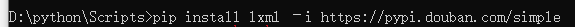
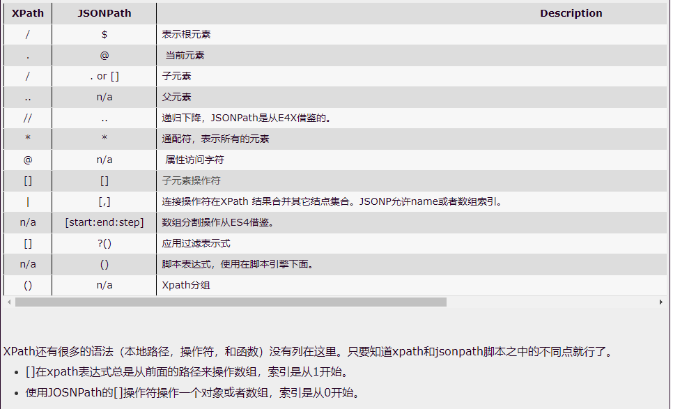
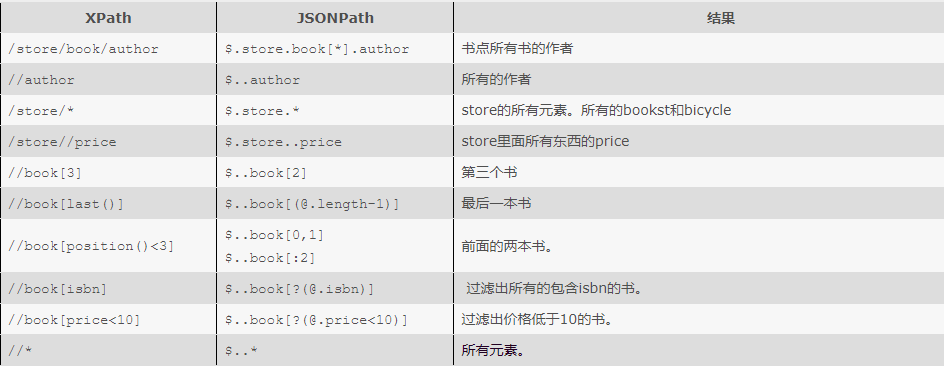

目录

[toc]


# Python基础复习总结


## 

用input()函数


```python
password = input("请输入密码:")
print('您刚刚输入的密码是:%s' % password)
```

注意: 

- input()的小括号中放入的是提示信息，用来在获取数据之前给用户的一个简单提示 
- input()在从键盘获取了数据以后，会存放到等号右边的变量中 
- input()会把用户输入的任何值都作为字符串来对待

## elif(else if)功能

```python
score = 77
if score>=90:
	print('本次考试，等级为A')
elif score>=80:
	print('本次考试，等级为B')
elif score>=70:
	print('本次考试，等级为C')
elif score>=60:
	print('本次考试，等级为D')
elif score<60:
	print('本次考试，等级为E')
```


## for循环

```python
for 临时变量 in 列表或者字符串等可迭代对象:
	循环满足条件时执行的代码
```

- range()表示范围


## 字符串高级(str)

```python
# - 获取长度:len                   len函数可以获取字符串的长度。
# - 查找内容:find                  查找指定内容在字符串中是否存在，如果存在就返回该内容在字符串中第一次出现的开始位置索引值，如果不存在，则返回-1.
# - 判断:startswith,endswith      判断字符串是不是以谁谁谁开头/结尾
# - 计算出现次数:count              返回 str在start和end之间 在 mystr里面出现的次数
# - 替换内容:replace               替换字符串中指定的内容，如果指定次数count，则替换不会超过count次。
# - 切割字符串:split               通过参数的内容切割字符串
# - 修改大小写:upper,lower         将字符串中的大小写互换
# - 空格处理:strip                去空格
# - 字符串拼接:join                 字符串拼接
```

```python
s = 'china'
print(len(s))   #5

s1 = 'china'
print(s1.find('a'))  #4

s2 = 'china'
print(s2.startswith('h'))  #False
print(s2.endswith('n'))   #False

s3 = 'aaabb'
print(s3.count('b'))     #2

s4 = 'cccdd' 
print(s4.replace('c','d'))    #ddddd

s5 = '1#2#3#4'
print(s5.split('#'))    #['1', '2', '3', '4']

s6 = 'china'
print(s6.upper())     #CHINA

s7 = 'CHINA'
print(s7.lower())      #china

s8 = '   a   '
print(len(s8))       #7

print(len(s8.strip()))   #1

s9 = 'a'
print(s9.join('hello'))   #haealalao
```


## 列表高级(list)

- #### 索引为**负数**形式

  - ```python
    windows[-1]#windows = [1,2,3,4,5] 他选择的是最后一个 这样就不需要用len来选择了 太聪明了挖槽
    ```

- #### 形式:方括号[]

  ```python
  food_list = ['铁锅炖大鹅','酸菜五花肉']
  print(food_list)      ['铁锅炖大鹅', '酸菜五花肉']
  ```

- #### 添加

  - append
  - insert
  - extend

```python
# append  追加   在列表的最后来添加一个对象/数据
food_list.append('小鸡炖蘑菇')
print(food_list)       #['铁锅炖大鹅', '酸菜五花肉', '小鸡炖蘑菇']

# insert  插入
char_list = ['a','c','d']    #['a', 'c', 'd']
print(char_list)
# index的值就是你想插入数据的那个下标
char_list.insert(1,'b')
print(char_list)      #['a', 'b', 'c', 'd']

# extend 继承
num_list = [1,2,3]
num1_list = [4,5,6]

num_list.extend(num1_list)
print(num_list)        #[1, 2, 3, 4, 5, 6]
```


- #### 修改

  - ##### 直接赋值

```py
city_list = ['北京','上海','深圳','武汉','西安']

print(city_list)

# 将列表中的元素的值修改
# 可以通过下标来修改，注意列表中的下标是从0开始的
city_list[4] = '大连'
print(city_list)
```


- #### 查询

```py
ball_list = ['篮球','台球']

# 在控制台上输入你喜欢的球类 然后判断是否不在这个列表中
ball = input('请输入您喜欢的球类')

if ball not in ball_list:
    print('不在')
else:
    print('在')
```

- #### 删除

```py
#del根据下标直接删除
a_list = [1,2,3,4,5]
del a_list[2]
print(a_list)

#pop是删除列表中的最后一个元素
b_list = [1,2,3,4,5]
print(b_list)
b_list.pop()
print(b_list)

#remove根据元素来删除列表
c_list = [1,2,3,4,5]
print(c_list)
c_list.remove(3)
print(c_list)
```


## 元组高级(tuple)

- #### 形式:小括号()

- #### 不同:不能修改里面的内容

- #### 相同:访问元素的方式与列表相同

```py
a_tuple = (1,2,3,4)

print(a_tuple[0])
print(a_tuple[1])
```

- #### 注意:

  - #### 定义只有一个元素的元组，需要在唯一的元素后写一个逗号

```py
# 当元组中只要一个元素的时候  那么他是整型数据
# 定义只有一个元素的元组，需要在唯一的元素后写一个逗号
a_tuple = (5)
print(type(a_tuple))

b_tuple = (5,)
print(type(b_tuple))
```


## 切片

- #### 字符串、列表、元组都支持切片操作

- #### 字符串

```py
s ='hello world'

# 在切片中直接写一个下标
print(s[0])      #h

#####!左闭右开区间!###   包含坐标的数据 不包含右边的数据
print(s[0:4])      #hell

# 是从起始的值开始  一直到末尾
print(s[1:])       #ello world

# 是下标为0的索引的元素开始 一直到第二参数为止   遵循左闭右开区间
print(s[:4])        #hell

# hello  world
# 从下标为0的位置开始 到下标为6的位置结束  每次增长2个长度 遵循左闭右开区间
print(s[0:6:2])      #hlo
```


## 字典高级(dic)

- #### 形式:{}

```py
person = {'name':'吴签','age':28}
```


- #### 访问方式

```py
# 访问person的name
print(person['name'])
print(person['age'])

# 使用[]的方式，获取字典中不存在的key的时候  会发生异常   keyerror
print(person['sex'])

# 不能使用.的方式来访问字典的数据
print(person.name)

print(person.get('name'))
print(person.get('age'))

# 使用.的方式，获取字典中不存在的key的时候  会返回None值
print(person.get('sex'))
```


- #### 修改

  - 直接赋值

    ```py
    # 修改name的值为法外狂徒
    person['name'] = '法外狂徒'
    ```


- #### 添加

  - 直接赋值

    ```py
    # 如果使用变量名字['键'] = 数据时  这个键如果在字典中不存在  那么就会变成新增元素
    person['age'] = 18
    ```


- #### 删除

  - #### del方式

    - ##### 删除指定元素

    - ##### 删除整个字典

  - #### clear方式

    - ##### 清空字典

  - #### pop方式

    - ##### pop('key')删除指定键名的项

    - ##### popitem()

```py
person = {'name':'老马','age':18}
#删除字典中指定的某一个元素
del person['age']
#删除整个字典
del person
#清空字典 但是保留字典对象
person.clear()
#删除之pop方式
person.pop('name')
person.popitem()
```


- #### 遍历

```py
# (1) 遍历字典的key
# 字典.keys() 方法 获取的字典中所有的key值  key是一个变量的名字 我们可以随便起
for key in person.keys():
    print(key)

# (2) 遍历字典的value
#字典.values()方法  获取字典中所有的value值   value也是一个变量 我们可以随便命名
for value in person.values():
    print(value)

# (3) 遍历字典的key和value
for key,value in person.items():
	print(key,value)


# (4) 遍历字典的项/元素
for item in person.items():
    print(item)
```


- #### 复制字典

  - 使用 `copy()` 方法来复制字典

    ```py
    thisdict =	{
      "brand": "Porsche",
      "model": "911",
      "year": 1963
    }
    mydict = thisdict.copy()
    print(mydict)
    ```

  - 使用 `dict()` `方法创建字典的副本`

    ```py
    thisdict =	{
      "brand": "Porsche",
      "model": "911",
      "year": 1963
    }
    mydict = dict(thisdict)
    print(mydict)
    ```

​			

## 文件


- #### 使用open函数，可以打开一个已经存在的文件，或者创建一个新文件,需要自己关闭文件

  ```py
  f = open('test.txt', 'w') #默认情况下使用gdk的编码,要想汉字或中文,要指定编码格式为encoding = utf-8
  ```


- #### 使用with open函数,会自动关闭文件

```py
def down_load(page,content):
# with open（文件的名字，模式，编码）as fp:
# fp.write(内容)
	with open('douban_'+str(page)+'.json','w',encoding='utf‐8')as fp:
		fp.write(content)
```


- #### 文件路径

  - 绝对路径：指的是绝对位置，完整地描述了目标的所在地，所有目录层级关系是一目了然的

    - 例如： `D:\python`，从电脑的盘符开始，表示的就是一个绝对路径。 

    

  - 相对路径：是从当前文件所在的文件夹开始的路径。

    -  `test.txt` ，是在当前文件夹查找 `test.txt `文件 
    - `./test.txt`，也是在当前文件夹里查找 `test.txt` 文件， 
    - `./` 表示的是当前文件夹。
    - `../test.txt` ，从当前文件夹的上一级文件夹里查找 `test.txt` 文件。 
    - `../` 表示的是上一级文件夹
    - `demo/test.tx` ，在当前文件夹里查找 `demo` 这个文件夹，并在这个文件夹里查找 `test.txt` 文件。

- #### 访问模式

  | 访问模式 | 说明                                                         |
  | :------: | :----------------------------------------------------------- |
  |    r     | 以只读方式打开文件。文件的指针将会放在文件的开头。如果文件不存在，则报错。这是==默认模式==。 |
  |    w     | 打开一个文件只用于写入。如果该文件已存在则将其==覆盖==。如果该文件不存在，**==创建新文件==**。 |
  |    a     | 打开一个文件用于追加。如果该文件已存在，文件指针将会放在文件的结尾。也就是说，新的内容将会被写入到已有内容之后。如果该文件不存在，创建新文件进行写入。 |
  |    r+    | 打开一个文件用于读写。文件指针将会放在文件的开头。           |
  |    w+    | 打开一个文件用于读写。如果该文件已存在则将其覆盖。如果该文件不存在，创建新文件。 |
  |    a     | 打开一个文件用于读写。如果该文件已存在，文件指针将会放在文件的结尾。文件打开时会是追加模式。如果该文件不存在，创建新文件用于读写。 |
  |    rb    | 以二进制格式打开一个文件用于只读。文件指针将会放在文件的开头。 |
  |    wb    | 以二进制格式打开一个文件只用于写入。如果该文件已存在则将其覆盖。如果该文件不存在，创建新文件。 |
  |    ab    | 以二进制格式打开一个文件用于追加。如果该文件已存在，文件指针将会放在文件的结尾。也就是说，新的内容将会被写入到已有内容之后。如果该文件不存在，创建新文件进行写入。 |
  |   rb+    | 以二进制格式打开一个文件用于读写。文件指针将会放在文件的开头。 |
  |   wb+    | 以二进制格式打开一个文件用于读写。如果该文件已存在则将其覆盖。如果该文件不存在，创建新文件。 |
  |   ab+    | 以二进制格式打开一个文件用于读写。如果该文件已存在，文件指针将会放在文件的结尾。如果该文件不存在，创建新文件用于读写。 |

- #### 读与写

  - 写数据(write)

  ```py
  f = open('test.txt', 'w') 
  f.write('hello world, i am here!\n' * 5) 
  f.close()
  ```

  - 读数据(read),(readline),(readlines)

  ```py
  f = open('test.txt', 'r')
  content = f.read(5) # 最多读取5个数据
  print(content)
  print("‐"*30) # 分割线，用来测试
  
  content = f.read() # 从上次读取的位置继续读取剩下的所有的数据
  print(content)
  
  ```

  - 读数据(readline)

  ```py
  f = open('test.txt', 'r')
  
  content = f.readline()
  print("1:%s" % content)
  
  content = f.readline()
  print("2:%s" % content)
  
  f.close()
  ```

  - 读数据(readlines)
    - `readlines`可以按照行的方式把整个文件中的内容进行一次性读取，并且返回的是一个列表，其中每一行为列表的 一个元素。


  ```py
  f = open('test.txt', 'r')
  
  content = f.readlines()
  print(type(content))
  
  for temp in content:
  print(temp)
  
  f.close()
  ```


## 序列化与反序列化

- ###### 通过文件操作，我们可以将字符串写入到一个本地文件。但是，如果是一个对象(例如列表、字典、元组等)，就无 法直接写入到一个文件里，需要对这个对象进行序列化，然后才能写入到文件里。

  ----------------------------------

- ##### 利用json模块来实现序列化与反序列化

----------

- ### 序列化

  - ```py
    import json
    file = open('names.txt', 'w')
    names = ['zhangsan', 'lisi', 'wangwu', 'jerry', 'henry', 'merry', 'chris']
    # file.write(names) 出错，不能直接将列表写入到文件里
    # 可以调用 json的dumps方法，传入一个对象参数
    result = json.dumps(names)
    # dumps 方法得到的结果是一个字符串
    print(type(result)) # <class 'str'>
    # 可以将字符串写入到文件里
    file.write(result)
    file.close()
    ```

    

  - ### 注意

    - #### `dumps()`方法的作用是把**对象转换成为字符串**，它本身不具备将数据写入到文件的功能。

    - #### `dump()`方法可以在将对象转换成为字符串的同时，指定一个文件对象，把转换后的**字符串写入到这个文件**里。

      - ```py
        import json
        
        # dump方法可以接收一个文件参数，在将对象转换成为字符串的同时写入到文件里
        json.dump(names, file)
        file.close()
        ```
        
  ------------------------------


- ### 反序列化

  - #### 使用loads或load方法

    - ```py
      import json
      
      # 调用loads方法，传入一个字符串，可以将这个字符串加载成为Python的对象
      result = json.loads('["zhangsan", "lisi", "wangwu", "jerry", "henry", "merry", "chris"]')
      
      print(type(result)) # <class 'list'>
      ```

    - ```py
      import json
      
      # 以可读方式打开一个文件
      file = open('names.txt', 'r')
      
      # 调用load方法，将文件里的内容加载成为一个Python对象
      result = json.load(file)
      
      print(result)
      file.close()
      ```

    - 总结:

      1. ## loads传入的是**字符串**

      2. ## load传入的是**文件**

​		

## 异常

- #### try...except语句

```py
#try:
	#可能会出现异常的代码块
#except 异常的类型:
	#出现异常以后的处理语句

try:
	f = open('test.txt', 'r')
	print(f.read())
except FileNotFoundError:
	print('文件没有找到,请检查文件名称是否正确')
```


# Python爬虫复习总结


## 模块下载(pip下载)

- 找到解释器(interpreter)位置:
  - 我的位置
  - 安装在D盘的python当中的Scripts文件夹里

- 如图

  
  
- #### 第三方库

  - [Python 第三方库、模块安装和卸载方法以及国内镜像-逍遥峡谷 (icoa.cn)](https://www.icoa.cn/a/886.html)

  - ```py
    pip install python-docx -i https://pypi.douban.com/simple
    ```

    


----------------------------------------------

## Urllib

### 导包

- ```py
  import urllib.request
  import urllib.parse
  ```

----------------------------------------------

### Urllib库使用

- ```py
  urllib.request.urlopen() #模拟浏览器向服务器发送请求
  
  #response 服务器返回的数据
  	#response的数据类型是HttpResponse
  	#字节‐‐>字符串
  		解码decode
  	#字符串‐‐>字节
  		编码encode
  	read()       #字节形式读取二进制 扩展：rede(5)返回前几个字节
  	readline()   #读取一行
  	readlines()  #一行一行读取 直至结束
  	getcode()    #获取状态码
  	geturl()     #获取url
  	getheaders() #获取headers
  	
  urllib.request.urlretrieve()
  	#请求网页
  	#请求图片
  	#请求视频
  
  ```

----------------------------------------------

### 请求

- ```py
  import urllib.request
  
  url = 'http://www.baidu.com'
  
  #response的数据类型是HttpResponse
  response = urllib.request.urlopen(url)
  
  # （3）获取响应中的页面的源码  content 内容的意思
  # read方法  返回的是字节形式的二进制数据
  # 我们要将二进制的数据转换为字符串
  
  # 二进制--》字符串  解码  decode('编码的格式')
  content = response.read().decode('utf-8')
  
  # （4）打印数据
  print(content)
  ```

----------------------------------------------

### 响应所用的六个方法

- 
  
- | 类型                  | models.Response                 |
  | :-------------------- | :------------------------------ |
  | response.read()       | 字节形式读取二进制              |
  | response.read(5)      | 字节形式读取二进制              |
  | response.readline()   | 字节形式读取二进制              |
  | response.readlines()  | 字节形式读取二进制              |
  |                       |                                 |
  | response.geturl()     | 获取请求的url                   |
  | response.getcode()    | 响应的状态码                    |
  | response.getheaders() | 响应的头信息,获取是一个状态信息 |

- 
  
  ```py
  import urllib.request
  
  url = 'http://www.baidu.com'
  
  # 模拟浏览器向服务器发送请求
  response = urllib.request.urlopen(url)
  
  # 一个类型和六个方法
  response是HTTPResponse的类型
  print(type(response))
  
  # 按照一个字节一个字节的去读
  content = response.read()  #字节形式读取二进制
  print(content)
  
  # 返回多少个字节
  content = response.read(5)  #字节形式读取二进制
  print(content)
  
  # 读取一行
  content = response.readline()  #字节形式读取二进制
  print(content)
  
  #一行一行读,直到读完
  content = response.readlines()  #字节形式读取二进制
  print(content)
  
  # 返回状态码  如果是200了 那么就证明我们的逻辑没有错
  print(response.getcode())
  
  # 返回的是url地址
  print(response.geturl())
  
  # 获取是一个状态信息
  print(response.getheaders())
  
  # 一个类型 HTTPResponse
  # 六个方法 read  readline  readlines  getcode geturl getheaders
  ```

------------------------------------------

### get请求

- #### urllib.parse.quote（）

  - 导包

  - ==将中文转换为Unicode格式==

  - #### ==urllib.request.Request来定制请求头==

```py
import urllib.request
import urllib.parse

url = 'https://www.baidu.com/s?wd='
headers = {'User‐Agent': 'Mozilla/5.0 (Windows NT 10.0; Win64; x64) AppleWebKit/537.36 (KHTML, likeGecko) Chrome/74.0.3729.169 Safari/537.36'}

url = url + urllib.parse.quote('小野')
request = urllib.request.Request(url=url,headers=headers)
response = urllib.request.urlopen(request)
```

- #### urllib.parse.urlencode（）

  - 导包

  - ==将多个参数转换为Unicode格式==

  - #### ==urllib.request.Request来定制请求头==

```py
import urllib.request
import urllib.parse

url = 'http://www.baidu.com/s?'
data = {'name':'小刚','sex':'男',}

data = urllib.parse.urlencode(data)
url = url + data
print(url)

headers = {'User‐Agent': 'Mozilla/5.0 (Windows NT 10.0; Win64; x64) AppleWebKit/537.36 (KHTML,likeGecko) Chrome/74.0.3729.169 Safari/537.36'}

request = urllib.request.Request(url=url,headers=headers)
```

------------------------------

### post请求

- #### ==urllib.request.Request来定制请求头==

```py
eg:百度翻译
import urllib.request
import urllib.parse

url = 'https://fanyi.baidu.com/sug'

headers = {'user‐agent': 'Mozilla/5.0 (Windows NT 10.0; Win64; x64) AppleWebKit/537.36 (KHTML, likeGecko) Chrome/74.0.3729.169 Safari/537.36'}

keyword = input('请输入您要查询的单词')

#参数是放在请求对象定制的方法中，编码之后需要调用encode方法
data = {'kw':keyword}

data = urllib.parse.urlencode(data).encode('utf‐8')
request = urllib.request.Request(url=url,headers=headers,data=data)
response = urllib.request.urlopen(request)

print(response.read().decode('utf‐8'))
```

----------------------------------------------

- # 总结

  - ### `get请求方式的参数必须编码，参数是拼接到url后面，编码之后不需要调用encode方法` 

  - ### `post请求方式的参数必须编码，参数是放在请求对象定制的方法中，编码之后需要调用encode方法`

----------------------------


### Cookie登陆

- #### 绕过登陆直接进入页面

  - ```py
    #cookie中携带着你的登陆信息   如果有登陆之后的cookie,那么我们就可以携带cookie进入到任何页面
    #referer判断当前路径是不是由上一个路径进来的   一般情况下 是做图片防盗链
    ```

- #### 通过selenium获取cookies

  - 

  - ```py
    from selenium import webdriver
    
    url = 'http://www.baidu.com'
    driver = webdriver.Chrome()
    driver.get(url)
    
    #关键步骤
    cookies = {data['name']:data['value']for data in driver.get_cookies()}
    ```


----------------------


### Handler处理器(代理手段)

- #### Handler 定制更高级的请求头（随着业务逻辑的复杂 请求对象的定制已经满足不了我们的需求（动态cookie和代理 不能使用请求对象的定制）

- #### handler、build_opener、open

  - 基本格式

    - ```py
      import urllib.request
      
      request = urllib.request.Request(url=url,headers=headers)
      
      handler = urllib.request.HTTPHandler() #HTTPHandle      handler
      opener = urllib.request.build_opener(handler) #build_opener
      response = opener.open(request) #open
      
      print(response.read().decode('utf‐8'))
      
      ```

  - #### 使用代理时,只需要变一个名字(ProxyHandler)

    - ```py
      eg:
      import urllib.request
      
      request = urllib.request.Request(url=url,headers=headers)
      
      proxies = {'http':'117.141.155.244:53281'}
      
      handler = urllib.request.ProxyHandler(proxies=proxies) #ProxyHandler
      opener = urllib.request.build_opener(handler)
      response = opener.open(request)
      
      content = response.read().decode('utf‐8')
      ```

  ------------------------------------------------------

- #### 代理池

  - #### random模块

    - ```py
      proxies_pool = [
          {'http':'118.24.219.151:16817'},
          {'http':'118.24.219.151:16817'},
      ]
      
      import random
      
      proxies = random.choice(proxies_pool)
      ```

-------------------------------------------------

## 解析数据

----------------------------------------------------------------

### XPATH

- ### lxml

  - #### 安装模块(lxml)

    - ```py
      1.安装lxml库
      	pip install lxml ‐i https://pypi.douban.com/simple
      2.导入lxml.etree
      	from lxml import etree
      3.#etree.parse() #解析本地文件
      	html_tree = etree.parse('XX.html')
      4.#etree.HTML() #服务器响应文件
      	html_tree = etree.HTML(response.read().decode('utf‐8')
      4.html_tree.xpath(xpath路径)
      ```

  - #### 开始解析

    - #### 解析规则

      - ```py
        from lxml import etree
        
        # xpath解析
        # （1）本地文件                                                etree.parse
        # （2）服务器响应的数据  response.read().decode('utf-8') *****   etree.HTML()
        
        # xpath解析本地文件
        tree = etree.parse('070_尚硅谷_爬虫_解析_xpath的基本使用.html')
        
        #tree.xpath('xpath路径')
        
        # 查找ul下面的li
        li_list = tree.xpath('//body/ul/li')
        
        # 查找所有有id的属性的li标签
        # text()获取标签中的内容
        li_list = tree.xpath('//ul/li[@id]/text()')
        
        # 找到id为l1的li标签  注意引号的问题
        li_list = tree.xpath('//ul/li[@id="l1"]/text()')
        
        # 查找到id为l1的li标签的class的属性值
        li = tree.xpath('//ul/li[@id="l1"]/@class')
        
        # 查询id中包含l的li标签
        #/text()来获取值
        li_list = tree.xpath('//ul/li[contains(@id,"l")]/text()')
        
        # 查询id的值以l开头的li标签
        li_list = tree.xpath('//ul/li[starts-with(@id,"c")]/text()')
        
        #查询id为l1和class为c1的
        li_list = tree.xpath('//ul/li[@id="l1" and @class="c1"]/text()')
        
        li_list = tree.xpath('//ul/li[@id="l1"]/text() | //ul/li[@id="l2"]/text()')
        
        # 判断列表的长度
        print(li_list)
        print(len(li_list))
        ```

---------------------------------------------------

### JSONPATH

- #### 安装模块

  - ```py
    #pip安装：
    pip install jsonpath
    ```

- #### 使用

  - ```py
    import json
    import jsonpath
    
    obj = json.load(open('json文件', 'r', encoding='utf‐8'))
    ret = jsonpath.jsonpath(obj, 'jsonpath语法')
    ```
    






------------------------------------


### BEAUTIFUL SOUP

- #### 安装模块

  - ```py
    1.安装
    pip install bs4
    ```

- #### 接收对象

  - ```py
    #2.导入
    from bs4 import BeautifulSoup
    
    #3.创建对象
    #服务器响应的文件生成对象
    soup = BeautifulSoup(response.read().decode(), 'lxml')
    
    #本地文件生成对象
    soup = BeautifulSoup(open('1.html'), 'lxml')
    
    #注意：默认打开文件的编码格式gbk所以需要指定打开编码格式
    ```

- #### 节点定位

  - #### 比较人性化

  - ```py
    1.根据标签名查找节点
    	soup.a 【注】只能找到第一个a
    	soup.a.name
    	soup.a.attrs
        	
    2.函数
    
    (1)#.find(返回一个对象)
    	find('a')：#只找到第一个a标签
    	find('a', title='名字')#标签
    	find('a', class_='名字')#标签  class要改成class_
        
    (2)#.find_all(返回一个列表)
    	find_all('a') 查找到所有的a
    	find_all(['a', 'span']) 返回所有的a和span #注意格式,要写成列表
    	find_all('a', limit=2) 只找前两个a
        
    (3)#.select(根据选择器得到节点对象)【推荐】(CSS语法)
    	# element
    		eg:p
            print(soup.select('a'))	#多个a标签
            
    	# .class
    		eg:.firstname
            print(soup.select('.a1'))
            
    	# #id
    		eg:#firstname
            print(soup.select('#l1'))
            
    	# 属性选择器
    		[attribute]
    			eg:li = soup.select('li[class]')
    		[attribute=value]
    			eg:li = soup.select('li[class="hengheng1"]')
            
    	# 层级选择器
        
        	#  后代选择器
    		element element
    			div p
            
            # 子代选择器
            # 注意：很多的计算机编程语言中 如果不加空格不会输出内容  但是在bs4中 不会报错 会显示内容
    		element>element
    			div>p
            
            # 找到div标签和p标签的所有的对象
    		element,element
    			div,p    
    				eg:soup = soup.select('a,span')
    ```

    - #### 注意

      - ```py
        # select()一般返回的是列表,记得选其中的内容才会变成标签
        ```

        

- #### 获取内容

  - ```py
    (1) #获取节点内容：适用于标签中嵌套标签的结构
    	obj.string
    	obj.get_text() #【推荐】
        
    (2) #节点的属性
    	tag.name  #获取标签名
    		eg:tag = find('li')
    			print(tag.name)
                          
    	
        #ag.attrs将属性值作为一个字典返回
        # 格式为 {'id': 'p1', 'class': ['p1']}
                      
    (3) #获取节点属性值
    	obj.attrs.get('title') #【常用】
    	obj.get('title')
    	obj['title']
    ```

  - #### 注意:

    - ```py
      # 如果标签对象中 只有内容 那么string和get_text()都可以使用
      
      # 如果标签对象中 除了内容还有标签 那么string就获取不到数据 而get_text()是可以获取数据
      ```


--------------------------------------------


## Selenium


- #### 如何安装selenium？ 

  - （1）操作谷歌浏览器驱动下载地址 

    - [链接](http://chromedriver.storage.googleapis.com/index.html )
    - edge
      - 


​    

  - （2）谷歌驱动和谷歌浏览器版本之间的映射表

    - [链接](http://blog.csdn.net/huilan_same/article/details/51896672 )

    

  - （3）查看谷歌浏览器版本 谷歌浏览器右上角‐‐>帮助‐‐>关于 

  

  - （4）`pip install selenium`

  

- #### 使用步骤

  - ```py
    #（1）导入：
    	from selenium import webdriver
    #（2）创建谷歌浏览器操作对象：
    	path = 谷歌浏览器驱动文件路径
    	browser = webdriver.Chrome(path)
    #（3）访问网址
    	url = 要访问的网址
    	browser.get(url)
    ```


- #### 元素定位

  - #### 导包

    - 

    - ```py
      from selenium.webdriver.common.by import By
      ```

  - ```py
    #1.find_element_by_id
    	eg:button = browser.find_element_by_id('su')
        
    #2.find_elements_by_name
    	eg:name = browser.find_element_by_name('wd')
        
    #3.find_elements_by_xpath
    	eg:xpath1 = browser.find_elements_by_xpath('//input[@id="su"]')
        
    #4.find_elements_by_tag_name
    	eg:names = browser.find_elements_by_tag_name('input')
        
    #5.find_elements_by_css_selector改为browser.find_elements(by=By.CSS_SELECTOR, value='')
    	eg:my_input = browser.find_elements_by_css_selector('#kw')[0]
        browser.find_elements(by=By.CSS_SELECTOR, value='.header-login-entry')[0]
        
    #6.find_elements_by_link_text
    	eg:browser.find_element_by_link_text("新闻")
    ```

    

- #### 元素信息与交互

  - ```py
    #获取元素属性
    	.get_attribute('class')
    #获取元素文本
    	.text
    #获取标签名
    	.tag_name
    
    #点击:
    	click()
    #输入:
    	send_keys()
    #后退操作:
    	browser.back()
    #前进操作:
    	browser.forword()
    #模拟JS滚动:
    	js='document.documentElement.scrollTop=100000'
    	browser.execute_script(js) 执行js代码
    #获取网页代码：
    	page_source
        
    #截图:
    	browser.save_screenshot('baidu.png')
        
    #退出：
    	browser.quit()
    ```

- 


------------------------------------------------


## Request


### 基本使用

- 安装

  - ```'py
    pip install requests
    ```

- response的属性以及类型

  - | 类型                 |  models.Response   |
    | :------------------- | :----------------: |
    | response.text        |    获取网站源码    |
    | response.encoding    | 访问或定制编码方式 |
    | response.url         |   获取请求的url    |
    | response.content     |   响应的字节类型   |
    | response.status_code |    响应的状态码    |
    | response.headers     |    响应的头信息    |

------------------------------------------

### Get请求

- #### requests.get()

- ```py
  import requests
  url = 'http://www.baidu.com/s?'
  
  headers = {
  'User‐Agent': 'Mozilla/5.0 (Windows NT 10.0; WOW64) AppleWebKit/537.36 (KHTML,like Gecko) Chrome/65.0.3325.181 Safari/537.36'}
  
  data = {
  'wd':'北京'
  }
  
  # url  请求资源路径
  # params 参数
  # kwargs 字典
  response =
  requests.get(url,params=data,headers=headers)
  
  #定制参数
  	#参数使用params传递
  	#参数无需urlencode编码
  	#不需要请求对象的定制
  	#请求资源路径中？可加可不加
      
  
  ```

- ### 总结

  - ##### （1）参数使用params传递

  - ##### （2）参数无需urlencode编码

  - ##### （3）不需要请求对象的定制

  - ##### （4）请求资源路径中的？可以加也可以不加

------------------------------------


### Post请求

- requests.post()

- ```py
  import requests
  post_url = 'http://fanyi.baidu.com/sug'
  
  headers={
  'User‐Agent': 'Mozilla/5.0 (Windows NT 10.0; Win64; x64) AppleWebKit/537.36(KHTML, like Gecko) Chrome/68.0.3440.106 Safari/537.36'}
  
  data = {
  'kw': 'eye'
  }
  
  # url 请求地址
  # data 请求参数
  # kwargs 字典
  
  r = requests.post(url = post_url,headers=headers,data=data)
  
  ```

  - ### 总结

    - ##### （1）post请求 是不需要编解码

    - ##### （2）post请求的参数是data

    - ##### （3）不需要请求对象的定制

  ------------------------------------

  

- #### get和post区别？

  1. ### get请求的参数名字是**params** 		post请求的参数的名字是**data**

  2. ### 请求资源路径后面可以不加? 

  3. ### 不需要手动编解码 

  4. ### 不需要做请求对象的定制

-------------------------------------------

### 代理

- ```py
  proxy定制
  在请求中设置proxies参数
  参数类型是一个字典类型
  eg:
  import requests
  url = 'http://www.baidu.com/s?'
  
  headers = {
  'user‐agent': 'Mozilla/5.0 (Windows NT 10.0; WOW64) AppleWebKit/537.36 (KHTML,like Gecko) Chrome/65.0.3325.181 Safari/537.36'
  }
  
  data = {
  'wd':'ip'
  }
  
  proxy = {
  'http':'219.149.59.250:9797'
  }
  r = requests.get(url=url,params=data,headers=headers,proxies=proxy)
  
  with open('proxy.html','w',encoding='utf‐8') as fp:
  fp.write(r.text)
  ```

-------------------------------------------------

### Session

- ```py
  session = requests.session()
  # 验证码的url的内容
  response_code = session.get(code_url)
  # 注意此时要使用二进制数据  因为我们要使用的是图片的下载
  content_code = response_code.content
  ```

--------------------------------

## Scrapy

- 


