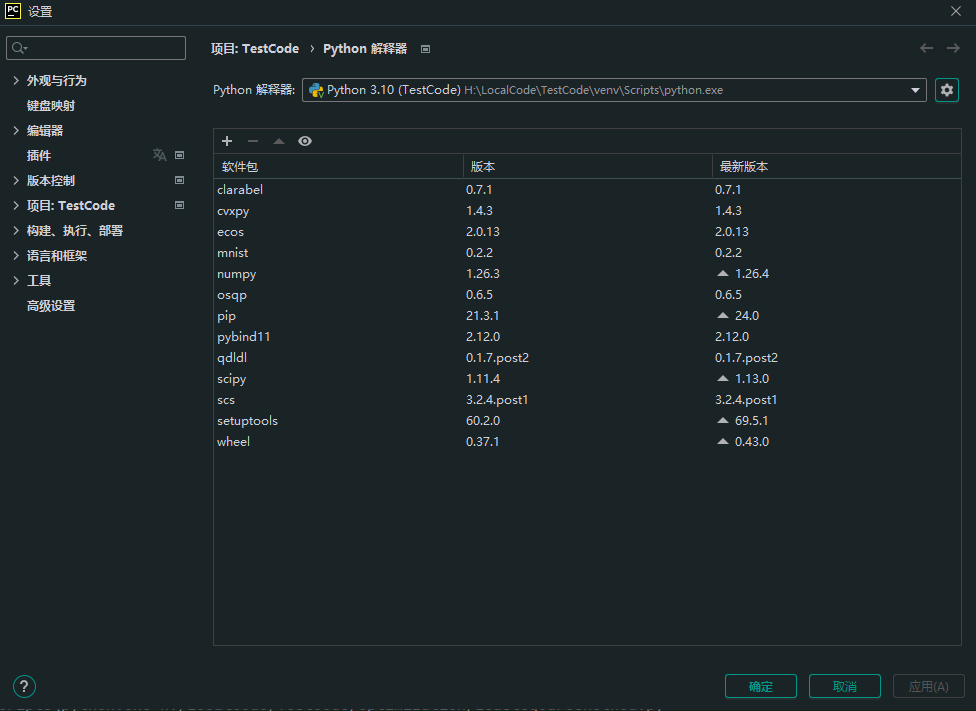
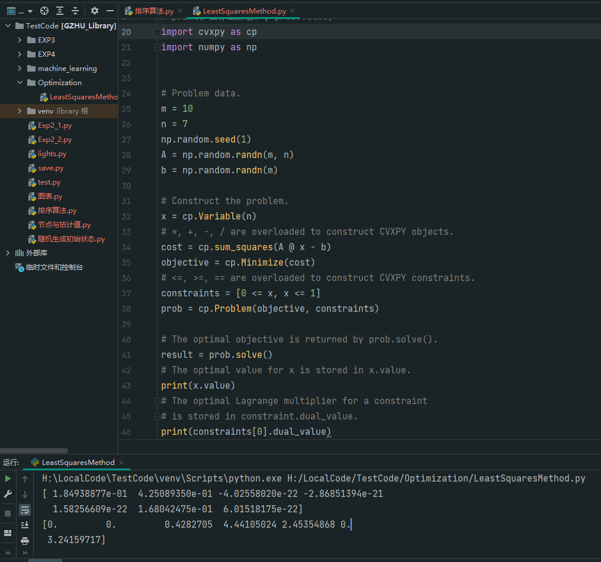

pip安装以下依赖

运行代码

这段Python代码使用了`cvxpy`库，这是一个专门用于凸优化问题的库。代码的目的是设置并解决一个简单的二次规划问题，其具体解释如下：

1. 首先，导入所需的库`cvxpy`和`numpy`。`cvxpy`用于建模和解决优化问题，`numpy`用于数值计算。
2. 接着，定义问题的数据：
   - `m`和`n`分别是矩阵`A`的行数和列数，其中`m=10`，`n=7`。
   - 设置随机数种子为1，以确保生成的随机数是可重复的。
   - 生成一个`m`行`n`列的随机高斯分布的矩阵`A`。
   - 生成一个长度为`m`的随机高斯分布向量`b`。
3. 接下来，构建优化问题：
   - 定义一个长度为`n`的变量`x`，这将是我们优化问题的决策变量。
   - 定义成本函数`cost`，它是平方和`cp.sum_squares(A @ x - b)`，这里`@`是矩阵乘法。我们希望最小化`A * x`与`b`之间的差的平方和，这是一个最小二乘问题。
   - 创建一个目标函数`objective`，其目的是最小化`cost`。
   - 定义一组约束`constraints`，要求`x`中的所有元素都在0和1之间。
4. 通过调用`cp.Problem`，将`objective`和`constraints`传递给构造函数以创建实际的优化问题`prob`。
5. 通过调用`prob.solve()`求解问题。这个调用使用cvxpy内部的求解器来找到最小化成本函数的`x`的值，并满足所有约束条件。
6. 解完问题后，最优的`x`值会被存储在`x.value`中。代码打印了这个值，即决策变量`x`在优化问题解决之后的最优值。
7. 对于每个约束，其对应的拉格朗日乘数（对偶变量）会被存储在`constraint.dual_value`中。这些乘数提供了关于约束在解中的“紧密度”的信息。如果乘数为正，这意味着对应的约束是活跃的（即，对应的约束在最优解时是一个等式）；如果乘数为零，表明约束在最优解时不是严格必需的。代码打印了第一个约束（`0 <= x`）的对偶变量值。

这段代码建模和求解了一个有线性约束的二次优化问题，输出了最优解和第一个约束的拉格朗日乘数。