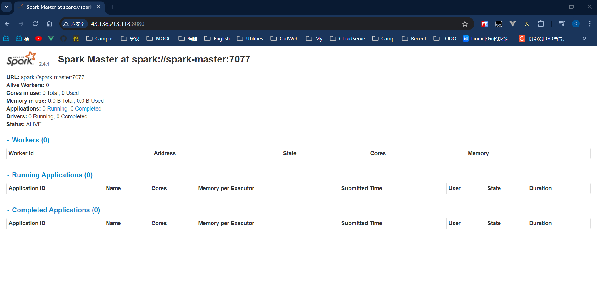
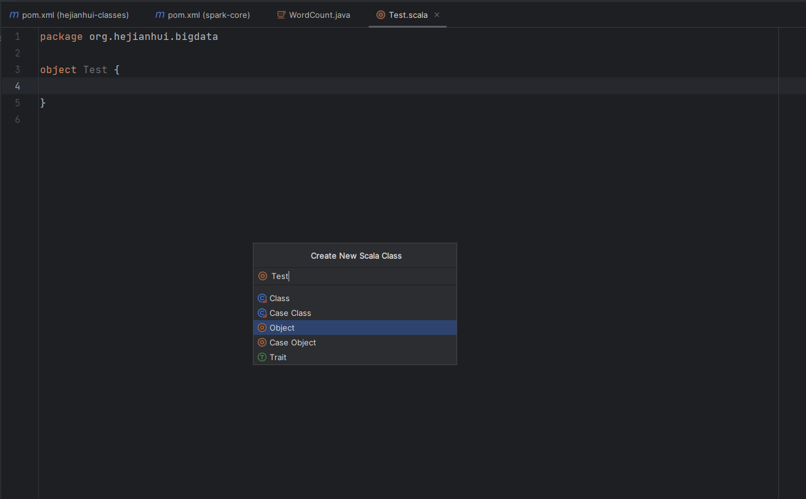
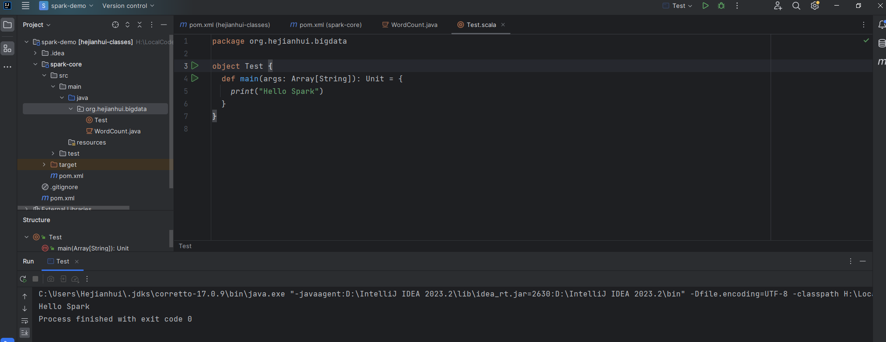
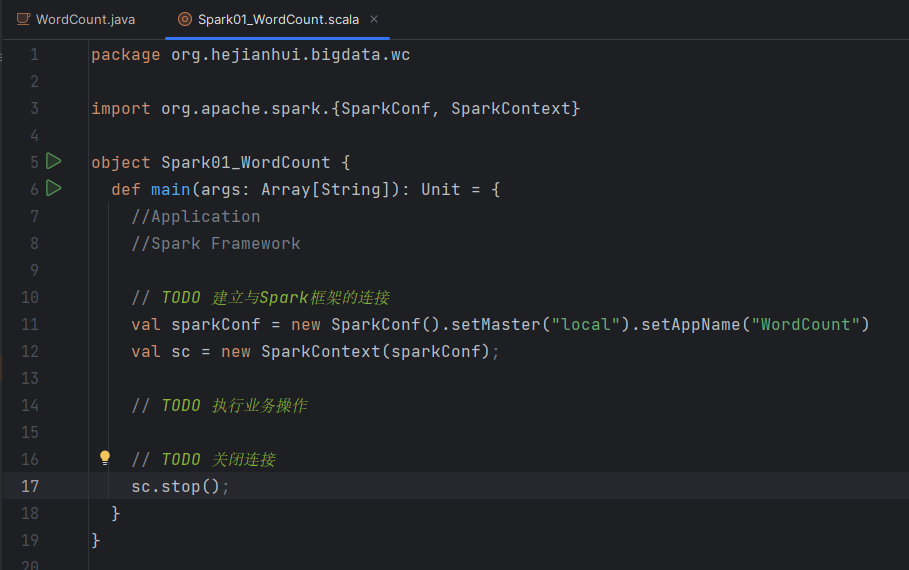
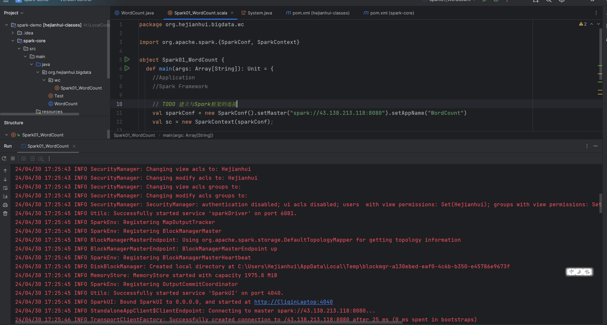
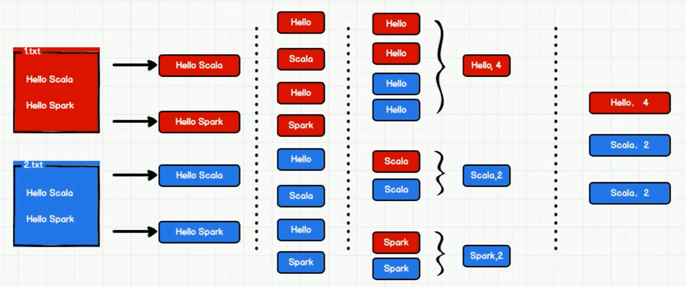

# 本地下载Spark

## 目标

在windows系统本地配置spark开发环境，能够通过idea开发spark项目


## 实现

### 1. 安装JDK

不赘述，你能看到这必然已经装好了jdk并配置好了环境变量。

需要注意的是，如果jdk安装目录有**空格**，需要在配置环境变量的时候，把`JAVA_HOME`的配置地址用**双引号**引起来，不然后边的hadoop识别会有问题

### 2. 安装Spark

到官网https://spark.apache.org/downloads.html选择合适的版本下载，注意Spark与Hadoop版本选择要相对应，建议下载预编译（`Pre-built`）好的版本，省得麻烦

下载完成后解压到你喜欢的目录，然后配置环境变量，例如解压在`C:\Users\dell\Documents\Env\spark-3.0.3-bin-hadoop3.2`目录下，则环境变量如下配置

- 配置变量名为`SPARK_HOME`，值为`C:\Users\dell\Documents\Env\spark-3.0.3-bin-hadoop3.2`
- 在`Path`变量下新建`%SPARK_HOME%\bin`

### 3. 安装Hadoop

到官网https://hadoop.apache.org/releases.html下载与上边的Spark对应的版本

下载完成后解压到你喜欢的目录，然后配置环境变量，例如解压在`C:\Users\dell\Documents\Env\hadoop-3.2.2`目录下，则环境变量如下配置

- 配置变量名为`HADOOP_HOME`，值为`C:\Users\dell\Documents\Env\hadoop-3.2.2`
- 在`Path`变量下新建`%HADOOP_HOME%\bin`

到这里https://github.com/cdarlint/winutils对应版本的bin目录下载`hadoop.dll`和`winutils.exe`，复制到hadoop目录的`bin`目录下

# 云端下载 spark

使用 docker 拉取一个社区上传的 spark 镜像，集成 JDK 等基础环境。

https://github.com/big-data-europe/docker-spark

### 创建一个 master 节点

```
 POWERSHELL$ docker run --name spark-master -h spark-master -e ENABLE_INIT_DAEMON=false -p 8080:8080 -v ${PWD}:/app -d bde2020/spark-master:2.4.1-hadoop2.7
```

> 使用 `-p` 暴露 8080 端口的服务到物理机上来，使用 `-v` 做一个磁盘文件和 container 内文件夹映射，方便存放文件，在物理机上编辑，在 container 里运行。

### 打开创建的节点

```
 POWERSHELL$ docker exec -it spark-master bash
```

> 使用 bash 脚本解释器打开 spark-master 这个镜像所创建的容器实例

### 探索

#### spark

[](https://tellyouwhat-static-1251995834.cos.ap-chongqing.myqcloud.com/img/20190716161821.png)

**根目录下有 spark 文件夹**

[](https://tellyouwhat-static-1251995834.cos.ap-chongqing.myqcloud.com/img/20190716161946.png)

> 通过上图可知，spark 的核心可执行文件，存放在 `/spark/bin`下，包括常用的 `spark-shell`、`pyspark`等

#### volume














-----------------

# 代码解释与输出

这段代码是一个典型的Apache Spark任务，用于计算文本数据中各个单词的出现频次，即经典的“Word Count”程序。下面将逐步解释代码的作用和执行流程。

### 代码解释及执行流程

#### Step 1: 初始化和配置Spark

```
java复制SparkConf conf = new SparkConf();
conf.setAppName("WordCount");
conf.setMaster("local");
JavaSparkContext sc = new JavaSparkContext(conf);
```

- `SparkConf` 对象是Spark的配置系统，它告诉Spark如何配置集群和应用参数。
- `setAppName("WordCount")` 设定应用程序的名称，可以在集群管理器的用户界面中看到。
- `setMaster("local")` 是一个特殊的设置，仅用于本地调试。它告诉Spark在本地机器上以单线程运行而不是在集群上。
- `JavaSparkContext` 是Spark功能的入口点，它代表到Spark集群的连接。这里，它用上述配置初始化。

#### Step 2: 创建初始RDD并执行转换操作

```
java复制JavaRDD<String> lines = sc.textFile("src/main/resources/input/wordcount/words.txt");
```

- `JavaRDD<String>` 是Resilient Distributed Dataset（RDD）的Java版本，它是Spark的基本抽象，代表一个不可变、分布式的对象集合。
- `sc.textFile` 方法读取一个文本文件并返回一个`String`类型的RDD，每个元素是文件的一行。

```
java复制JavaRDD<String> words = lines.flatMap(...)
```

- 使用`flatMap`转换操作处理`lines` RDD。`flatMap`是一种一对多的转换操作，它将每一行文本拆分为单词，并将结果扁平化为一个单词列表。

```
java复制JavaPairRDD<String, Integer> pairs = words.mapToPair(...)
```

- 使用`mapToPair`转换操作将每个单词映射为一个键值对（Pair），键是单词本身，值是数字1。这准备了数据进行下一步的计数操作。

```
java复制JavaPairRDD<String, Integer> wordCounts = pairs.groupByKey().mapToPair(...)
```

- 使用`groupByKey`转换操作对相同的键（单词）的所有值（频数）进行分组。
- 然后，使用`mapToPair`转换操作计算每个单词的总频数。

#### Step 3: 执行行动（Action）操作并输出结果

```
java复制wordCounts.foreach(t -> System.out.println(t._1 + " " + t._2));
```

- `foreach`是一个行动操作，它会触发Spark提交作业到集群，对`wordCounts` RDD中的每个元素执行给定的打印操作。

#### Step 4: 关闭SparkContext

```
java复制sc.stop();
```

- 最后，`stop`方法被调用来关闭`JavaSparkContext`，释放资源。

### 执行过程

1. **初始化SparkContext**：Spark应用程序开始时，会创建一个SparkContext对象，它告诉Spark如何访问集群。为了调试，这里使用了`local`模式。
2. **读取输入数据**：通过`sc.textFile`方法读取输入文件`words.txt`，这将创建一个初始的RDD。
3. **RDD转换操作**：
   - `flatMap`：将每行文本拆分为单词。
   - `mapToPair`：将每个单词映射为一个包含单词和数字1的元组。
   - `groupByKey`：按单词分组。
   - `mapToPair`：对于每个分组，计算单词的总频数。
4. **行动操作**：通过`foreach`将最终的词频统计结果输出到控制台。
5. **作业执行**：当调用行动操作时，Spark会将前面定义的转换操作组合起来并在集群上一起执行。
6. **关闭SparkContext**：作业结束后，释放与集群的连接。

### 总结

这个代码实现了一个文本词频统计应用。它展示了Spark编程模型的基本元素，包括创建Spark配置、初始化SparkContext、编写RDD转换和行动操作，以及最后的清理工作。在执行过程中，代码定义了如何从输入文件中读取数据，进行转换并计算结果，最终将结果打印出来。使用了Spark的分布式计算能力，尽管代码是在本地模式下运行，但可以很容易地迁移到一个真实的集群环境中。

--------



这个Java代码示例是一个使用Apache Spark进行词频统计的经典WordCount程序。下面是代码的操作步骤以及其将要输出的内容的分析：

1. **SparkConf和JavaSparkContext初始化**：
   - 创建`SparkConf`对象，设置应用程序名称为"WordCount"。
   - 设置Spark的master URL为"spark://43.138.213.118:8080"。这通常用于本地调试，并假设有一个在这个IP和端口上运行的Spark master。
   - 创建`JavaSparkContext`。
2. **创建RDD并进行转换**：
   - 读取`src/main/resources/input/wordcount/words.txt`文件，创建一个名为`lines`的RDD。
   - 将`lines`中的每一行使用空格分割成单个单词，创建一个新的`words` RDD。
   - 将`words` RDD中的每个单词转换为键值对形式（单词, 1），创建`pairs` RDD。
   - 使用`groupByKey`对`pairs` RDD中的键值对按照单词进行分组，然后对每组的频数值使用求和操作，创建`wordCounts` RDD。
3. **输出结果**：
   - 使用`foreach`操作遍历`wordCounts` RDD，将每个单词和其对应的计数输出到控制台。

注释掉的代码块是使用`reduceByKey`操作来进行词频统计的另一种方式，但在此代码中它是不活动的。如果激活，它会代替`groupByKey`操作并且更加高效，因为它在网络传输之前在每个节点上进行局部合并。

1. 停止SparkContext

   ：

   - 关闭`JavaSparkContext`。

假定代码无误且`src/main/resources/input/wordcount/words.txt`文件存在，代码执行时将连接至指定的Spark master并处理该文件。输出将是文件中每个独特单词及其出现次数的列表。例如，如果`words.txt`文件的内容如下：

```
复制hello world
hello spark
hello world
```

输出将类似于：

```
复制hello 3
world 2
spark 1
```

这个输出表示单词“hello”在文件中出现了3次，单词“world”出现了2次，而单词“spark”出现了1次。实际的输出可能会有不同的顺序，因为Spark中的操作可能是在不同的节点上并行执行的。