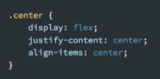

居中写法

 


debug.css

```css
/*! debug.css | MIT License | zaydek.github.com/debug.css */
*:not(path):not(g) {
	color:                    hsla(210, 100%, 100%, 0.9) !important;
	background:               hsla(210, 100%,  50%, 0.5) !important;
	outline:    solid 0.25rem hsla(210, 100%, 100%, 0.5) !important;

	box-shadow: none !important;
}
```


grid.css

```css
#a { grid-area: a; }
#b { grid-area: b; }
#c { grid-area: c; }
#d { grid-area: d; }
#e { grid-area: e; }

#grid {
    display: grid;
    grid-template-areas:
        "a a a a"
        "b c d e";

    grid-row-gap: 1rem;
}

@media (max-width: 512px) {
    #grid {
        grid-template-areas:
            "a a a"
            "b c d"
            "e e e";
    }
}
```


helpers.css

```css
.center, .center-column, .top, .right, .bottom, .left {
	display: flex;
	justify-content: center;
	align-items: center;
}

.center-column {
    flex-direction: column;
}

.top    { align-items:     flex-start; }
.right  { justify-content: flex-end;   }
.bottom { align-items:     flex-end;   }
.left   { justify-content: flex-start; }

.single-spaced, .single-spaced * {
    line-height: 1;
}

@media (max-width: 1024px) {
	.desktop {
		display: none;
	}
}
```

