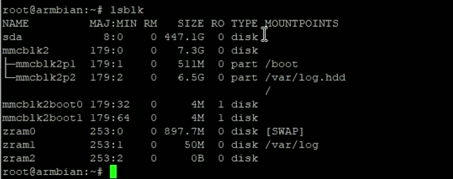

# 刷机

- 将镜像写入u盘

  

- 插入u盘(靠hdmi的口),插上网线,最后再插上电源

- 通过路由器查看分配的ip地址

- 用Xshell等工具进行ssh链接,账号为root.密码为1234

- 登陆成功后显示此页面

  

  

- 

- 设置好一些参数后

- 输入armbian-install安装系统到盒子的内存
- 接下来重启即可

# 设置常驻外置存储

- 插入u盘

- lsblk查看情况

  

- 使用fdisk初始化

  - 删除分区

- 添加分区

- 格式化

​			

- 在`/etc/rc.local`文件内加上`mount /dev/sda1 /mnt/sda1`开机执行命令自动挂载

# 安装docker及portainer

N1盒子刷armbian 当服务器，安装 docker+面板portainer-ce 一键安装命令，

先安装docker 设置yum源，国内腾讯云镜像速度更快 

`wget -O /etc/yum.repos.d/docker-ce.repo http://mirrors.aliyun.com/docker-ce/linux/centos/docker-ce.repo curl -fsSL https://get.docker.com | bash -s docker --mirror Aliyun` 

一、Docker服务设置自动启动 

1、查看已经启动的服务 

`systemctl list-units --type=service` 查看已启动的服务 

`systemctl list-unit-files | grep enable` 查看是否设置开机启动 

`systemctl enable docker.service` 设置开机启动 

`systemctl disable docker.service` 关闭开机启动

2、docker启动命令： 

`systemctl start docker `

3、查看是否设置开机启动 

`systemctl list-unit-files | grep docker `

4、设置开机启动 

`systemctl enable docker.service `

5、取消开机启动，执行命令： 

`systemctl disable docker.service` 

#Portainer

 二、拉取镜像

`docker pull portainer/portainer` 启动容器 

`docker run -d --name portainer -p 9000:9000 -v /var/run/docker.sock:/var/run/docker.sock -v /app/portainer_data:/data --restart always --privileged=true portainer/portainer:latest`

docker-ce面板：`http://localhost:9000/`

# U盘扩容法 

# 蓝牙驱动

如果需要蓝牙，那可以进行此步。

前提要在第一步中替换 meson-gxl-s905d-phicomm-n1.dtb 文件。电脑上用MobaXterm、winSCP等FTP软件登录n1，把我提供的 BCM4345C0.hcd 文件放到/lib/firmware/brcm这个目录。

回到ssh，输入armbian-config，选network -> BT install 。

安装完成后，先按ESC退出到命令行， reboot 重启。

然后用hciconfig命令，如果显示的BD ADDRESS其中一个不是0000...或者AAAA...就说明安装成功了。

`docker run -d --name portainer -p 9000:9000 -v /var/run/docker.sock:/var/run/docker.sock -v /mnt/sda1/local/docker/portainer_data:/data --restart=always --privileged=true portainer/portainer:latest`

`docker run -d --name="homeassistant" --restart=always --net=host -v /mnt/sda1/local/docker/homeassistant:/config -e TZ=Asia/Shanghai homeassistant/home-assistant:latest`

`docker run -d --name=xunlei --hostname=mynas --net=host -e XL_WEB_PORT=2345 -v /mnt/sda1/local/docker/xunlei:/xunlei/data -v /mnt/sda1/local/docker/xunlei_downloads:/xunlei/downloads --restart=always --privileged cnk3x/xunlei:latest`

`docker run -d --restart=unless-stopped -v /mnt/sda1/local/docker/alist:/opt/alist/data -p 5244:5244 -e PUID=0 -e PGID=0 -e UMASK=022 --name="alist" xhofe/alist:latest`

这个不行

`docker run -d --name qbittorrent -p 7881:7881 -p 7881:7881/udp -p 18080:18080 -v /mnt/sda1/local/docker/qbittorrent:/etc/qBittorrent -v /mnt/sda1/local/docker/qbittorrent_downloads:/downloads --restart=always helloz/qbittorrent`

下载不了东西

`docker run -d \
  --name qbittorrent \
  --restart always \
  -p 7881:7881 \
  -p 7881:7881/udp \
  -p 8080:8080 \
  -e PUID=1000 \
  -e PGID=1000 \
  -e TZ=Asia/Shanghai \
  -v /mnt/sda1/local/docker/qbittorrent:/config \
  -v /mnt/sda1/local/docker/qbittorrent_downloads:/downloads \
  linuxserver/qbittorrent`

/mnt/sda1/local/docker/utorrent_downloads

`docker run -d \
  --name qbittorrent \
  --restart always \
  --platform linux/arm64 \
  -p 6881:6881 \
  -p 6881:6881/udp \
  -p 8080:8080 \
  -e PUID=1000 \
  -e PGID=1000 \
  -e TZ=Asia/Shanghai \
  -v /mnt/sda1/local/docker/qbittorrent:/config \
  -v /mnt/sda1/local/docker/qbittorrent_downloads:/downloads \
  linuxserver/qbittorrent`

